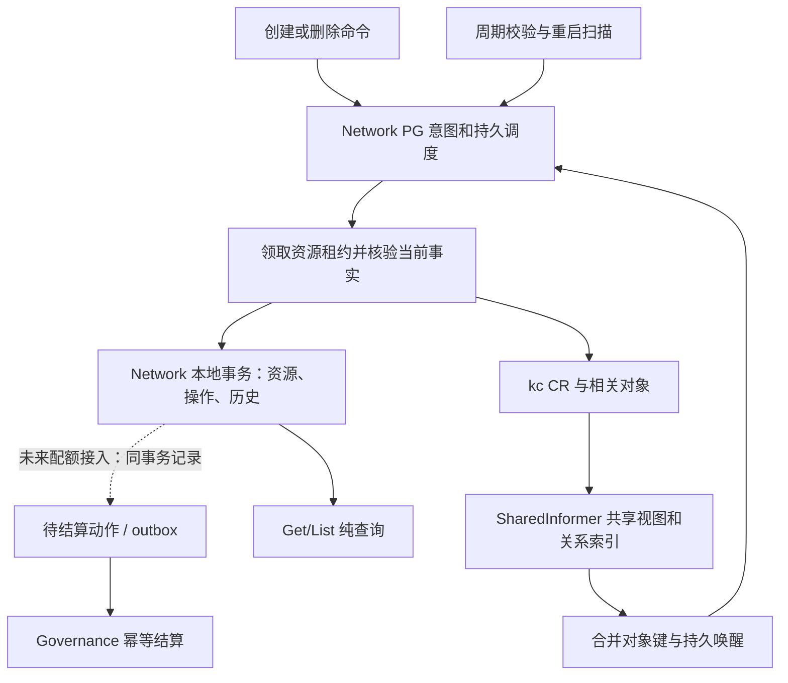

# CR 持续观察选型评估

日期：2026-09-10。性质：源码与主源研究、架构建议；不是已接受 ADR、现行规格替代物或实施完成记录。用户要求按可扩展方案评估，暂不设规模上限；没有据此承诺无限容量。

后续承接：用户要求形成正式方案并插在 NET-06 前，已建立 [ADR-0004](../../adr/0004-observe-cr-with-durable-reconciliation.md)、[持续观察目标规格](../../specs/cr-observation.md)与 [NET-05A 计划](../../plans/cr-observation.md)。以下保留选型时点的研究依据，正式目标以新材料为准；配额讨论仅作 Core 重构后的候选输入，不属于 NET-05A 实现或验收。本文来源指纹仍对应选型时文件，不能用于声称后续修改过的规格与旧指纹一致。

## 结论

推荐 **client-go dynamic SharedInformer 提供共享观察视图和变化通知，PostgreSQL 保存持久调度与业务意图，由服务自己的 worker 统一推进状态，并保留有时效预算的真实校验**。

这是对当前 Network 的具体推荐。推广到兄弟仓库的是领域所有权、基于当前事实收敛、持久恢复和幂等规则，不统一强制 client-go、PG 调度或某个进程框架。controller-runtime 是其他服务可以自主采用的正式实现选择，且不要求该服务必须以 CR 作为产品意图源。Network 当前继续使用 Kratos 管理进程生命周期，不因推广而新增 Manager/Reconciler、产品 CRD、中央观察服务或共享 ANI runtime。

各部分承担不同责任：Informer 降低变化发现延迟、共享集合与关联索引；PG 保证尚无 CR 的意图、重试、deadline 和恢复不丢；worker 解释当前事实并写入业务结果；周期校验发现遗漏、关系漂移和来源失效。这些入口汇入同一条资源执行路径。

纯轮询能够实现正确生命周期和配额，并非错误架构。但固定 10 秒逐资源读取、逐 Attachment 全集群扫描不适合作为持续扩展的默认。单纯在原循环旁加 Watch 只能加快感知，不能自动解决基线负载。

## 输入与证据范围

- 已实时读取置顶任务 **ANI架构职责重构**（`01a065fc-685d-7641-96ef-abf4cfee15fa`）和 **评估现有core重构方案**（`01a07f9d-c10b-7720-a4de-072ad0070fed`）。采用用户关于多路径收敛导致配额/审计副作用失效的历史问题，以及后续独立 Network 首切方向；没有把旧任务中的方案、时间估计或授权当作本轮实施授权。
- 本仓库现行所有权见 [规格](../../specs/vpc-subnet.md#2-所有权与模块接口)及 [ADR-0001](../../adr/0001-own-network-lifecycle.md)：Network 拥有网络产品生命周期，kc 拥有 CR 到 OVN 的收敛，实例 owner 拥有 Pod/VM，治理模块拥有全局配额账本。
- 本轮开始读取 `40ab0cf64246da13b43296dff8175f16738c12c4` 及当时 NET-02–04 工作区改动；期间并发任务把同批实现提交为 `5d4a53451beca0317bee1f577d8fb9cc189fc035`。本任务没有暂存、提交、推送或修改业务代码。以下依据实际文件内容，不将旧 HEAD 冒充完整源码快照。
- 核对路径集合：`cmd/ani-network-service/app.go`、`docs/specs/vpc-subnet.md`、`go.mod`、`internal/biz/attachment_worker.go`、`internal/biz/worker.go`、`internal/data/kc.go`、`internal/data/kc_attachment.go`、`internal/data/queries/attachments.sql`、`internal/data/queries/worker.sql`、`internal/data/resource_work.go`、`internal/data/worker.go`、`internal/server/worker.go`。按路径排序，对每个 `UTF8(path) + NUL + file_bytes + NUL` 连续计算 SHA-256：`eb3fb91dce84d181a1c42bca8457b3844a2d10aff78df00d8aa43b1a6d6f832d`。
- 外部机制以 Kubernetes 官方文档及 client-go `v0.36.0` 源码为依据。controller-runtime `v0.24.0` 仅用于同代实现比较，不是本仓库依赖。
- 本轮执行位置为本地，只做文档、源码、Git 读取和文档检查；没有编译、完整测试、访问集群或运行容量测试。正式实施仍遵循 [远程执行约定](../../remote-execution.md)。

## 当前实现暴露出的成本

| 源码事实 | 对选型的意义 |
|---|---|
| [WorkerServer](../../../internal/server/worker.go) 依次执行一个资源 Step 和一个 Attachment Step，每个 Step 最多处理一个对象 | 当前为串行执行；10 秒是完成后的再次调度间隔，不是端到端观察时延保证 |
| [claimResource](../../../internal/data/resource_work.go) 先找 VPC，找不到到期 VPC 才找 Subnet | VPC 持续积压时，Subnet 存在饥饿风险；新增 Watch 不会自动修复 |
| [KC Observe](../../../internal/data/kc.go) 正常每个 VPC/Subnet 发起 GET | 稳态成本随资源数增加；观察 deleted/failed 记录也有成本 |
| [领取与回写](../../../internal/data/worker.go)、[SQL](../../../internal/data/queries/worker.sql) 稳态仍有两个事务、至少四条 UPDATE | acquire lease、推进 resource（含 version）、保存 binding、release lease；即使状态不变，也有数据库更新和 WAL 开销。history 已避免无意义追加，但不能等同于不写库 |
| [Attachment 观察](../../../internal/data/kc_attachment.go) 对每个关联分别分页 LIST 全集群 Pod、VNic、VNicIP | 重复扫描比单个 VPC GET 更值得优先治理；released 墓碑仍参与调度 |
| [Attachment worker](../../../internal/biz/attachment_worker.go) 每轮查询实例 owner | K8s Watch 无法感知 owner 数据库里的 closing/closed；该 RPC 与恢复定时器有独立必要性 |
| [hasDependencies](../../../internal/data/kc.go) 检查子网、VNic/VNicIP/EIP 引用 | 只订阅 VPC/Subnet 不足以覆盖网络释放和孤儿关系 |

容量估算仅用于比较，未实测：N 个正常 VPC/Subnet、检查周期 T，完成目标工作量约为 `N/T` GET/s、`2N/T` PG 事务/s、至少 `4N/T` 行 UPDATE/s。N=10,000、T=10s 时，分别约 1,000、2,000、4,000；不表示当前串行 worker 能达到这个吞吐，也未包含 Attachment、重试、依赖查询与额外 SQL。

设 Attachment 数量 A、Pod/VNic/VNicIP 总数分别为 P/V/I，现有客户端重复处理规模接近 `A × (P+V+I) / T`。理想共享观察的常态增量成本则主要随相关变化数增长，初始同步与重新清点仍随对象总量增长，缓存内存也不是免费。

## 候选方案比较

| 方案 | 正确性与恢复 | 时效和规模 | 成本与结论 |
|---|---|---|---|
| 增强纯轮询：批量读、索引、有界并发、PG 任务 | 可以完整保留现行保证；不依赖事件 | 空闲对象也需反复读；更低延迟需要更频繁清点 | 有效的小规模或无 Watch Provider 方案；不选为本次长期默认 |
| Informer + 仅进程内队列，替代 PG 任务 | 不能仅凭 Provider CR 重建未发送创建、未知请求和所有业务 deadline | 变化发现快、共享缓存可降载 | 不适合当前 PG 保存产品意图的架构 |
| **Informer + PG 持久执行 + 有界真实校验** | 保留业务持久恢复；事件是可合并提示，漏提示由清点/定时器恢复 | 秒级感知目标；共享索引、分片和批量校验提供扩展路径 | **推荐**；必须处理通知竞态、freshness 和缓存缺失证明 |
| 额外产品 CRD + controller-runtime Operator，以 CR 保存产品意图 | 可做成完整持久控制系统，并非天然不可靠 | 与 K8s 控制器模型一致 | 会改变产品数据、幂等、operation、租户查询和事务权威；本次缺少这种重构必要 |

不能把“用了 Watch”当成更可靠：强化轮询也能保证配额。这里选择 Watch 的理由是变化感知和重复观察成本；选择 PG 与领域事务的理由是业务正确性。

## 技术实现选择与职责

**选 client-go dynamic SharedInformerFactory。** [go.mod](../../../go.mod) 已包含 `client-go/apimachinery v0.36.0`，[kc adapter](../../../internal/data/kc.go) 已使用 dynamic client，标准库足够提供 GVR 观察、共享缓存、索引和重连同步。复用标准能力，不手写 Watch 恢复协议。[动态 informer 主源](https://github.com/kubernetes/client-go/blob/v0.36.0/dynamic/dynamicinformer/informer.go)

controller-runtime 可以承担观察缓存、资源关系映射及 Reconcile 调度，也可以接入 PG 保存产品意图的服务；它不要求放弃数据库事务。对当前 Network，已有 PG 调度、租约和 Kratos 生命周期，本次增设完整 Manager/Reconciler 的桥接收益不足，因此推荐直接采用 client-go。兄弟服务可依据现有框架、资源关系和恢复模型选择 controller-runtime；重启后如何找回尚无 CR 的 PG 意图等义务仍需显式实现。[Reconcile 主源](https://github.com/kubernetes-sigs/controller-runtime/blob/v0.24.0/pkg/reconcile/reconcile.go)



| 位置 | 职责 |
|---|---|
| `internal/data` | informer、关系索引、长连接配置、Provider 身份映射、事实来源有效性和必要的直接 GET/LIST；隐藏 Kubernetes 类型 |
| `internal/biz` | 领域状态、操作、删除/占用语义，及所需端口；接收当前事实，不解释 Watch 回调类型 |
| PG 调度 adapter | 合并持久触发、执行租约、重试 deadline、恢复；不依赖内存队列保留业务工作 |
| `internal/server` 与 composition root | 管理观察和执行的启动/停止、健康和遥测；维持现有 Kratos 应用结构 |
| Gateway / Core | 消费版本化业务契约；不增加 CR observer、网络状态写入者或 Network 修复路径 |

Watch handler 只提取对象键和变化提示。回调不直接写 available/deleted、不执行 quota release、不同步等待慢 PG/RPC。内存 workqueue 用于合并和削峰；PG 持久调度仍是业务工作来源，队列积压/失败可观测，重启扫描和周期校验补回尚未持久化的提示。[workqueue 主源](https://github.com/kubernetes/client-go/blob/v0.36.0/util/workqueue/queue.go)

## 不能省略的正确性设计

### 1. 基于当前事实重算，不能依赖每个事件边沿

SharedInformer 最终一致，可能跳过对象的中间状态；不同对象之间没有共同顺序。重列举、重启、去重都不能改变业务结果。事件键应包含 cluster/GVR/namespace/name，UID 用于核验身份；`resourceVersion` 是不透明值，不能跨对象或集群做数字比较。[SharedInformer 契约](https://github.com/kubernetes/client-go/blob/v0.36.0/tools/cache/shared_informer.go)

需要响应 status-only 更新、删除时间、归属和引用变化。不能使用仅观察 generation 变化的过滤器，否则会漏掉 Ready/conditions 更新。旧标签到新标签、同名不同 UID、Delete tombstone、owner 引用乱序都需要重算。[过滤器主源](https://github.com/kubernetes-sigs/controller-runtime/blob/v0.24.0/pkg/predicate/predicate.go)、[删除 tombstone](https://github.com/kubernetes/client-go/blob/v0.36.0/tools/cache/delta_fifo.go)

### 2. 在途事件不能被 Finish 覆盖

现有 `ReleaseLease` 将 `next_run_at` 无条件改为 `now + delay`；Attachment Finish 对 `next_check_at` 同理。如果事件在领取后到达，只执行 `next_run_at=now`，Finish 会覆盖这次唤醒。

建议使用独立持久 `requested_generation/processed_generation` 或等价机制：事件增加待处理代次但不撤销有效租约；Claim 捕获代次；Finish 在同事务发现新代次则保留下次执行。lease epoch 只保护执行身份，不能兼作通知序号。也不能复用会清租约和增加 epoch 的删除调度 SQL。

同一资源事件合并，新的相关事实可触发重新核验；重复事件不能无限绕过 Provider 故障退避。公平性必须涵盖资源类型、租户和父资源，替换现有 VPC 永远优先的选择策略。采用有界并发，不让一次慢 Attachment 扫描阻塞所有生命周期执行。

### 3. freshness、缓存同步与连接健康分开表达

现行 [观察时效规格](../../specs/vpc-subnet.md)要求默认 60 秒有效期；[Subnet 准入](../../../internal/data/subnet.go)与 [Attachment 准入](../../../internal/data/attachment.go)实际依赖父资源的有效观察时间。这是业务约束，不能为了减少请求悄悄取消。

- 长期没有事件可能表示资源一直稳定；不能仅因沉默就 degraded。
- `HasSynced` 只说明初次同步，不能证明现在健康。
- informer resync 重放本地缓存，不等于重新 LIST，也不能刷新“真实核验时间”。
- BOOKMARK 不保证周期或必达，不能单独充当每资源心跳。[API 主源](https://kubernetes.io/docs/reference/using-api/api-concepts/#watch-bookmarks)

建议内部区分最近实际核验、最近状态变化、视图同步代次及处理进度。普通缓存观察只能沿用其来源证据时间，不能把读取缓存或事务提交的时刻伪装成新观察；跨 Pod/VNic/VNicIP 的结论要采用最弱的有效证据，单个 CR 更新不能刷新整条关系链的证明。

首次实现保留现有 60 秒语义时，可把稳定资源真实校验约 30 秒并带抖动作为待测起点，必须满足“校验间隔 + 抖动 + 最坏排队 + 完整分页采集 + 应用/提交预算 < 60 秒”，不能将数值当作已验证 SLO。创建/删除/未知结果和 owner 封闭仍使用各自持久 deadline。

持续扩展目标应采用按观察范围共享的真实集合清点及索引，避免逐资源扫描同一集合。批量清点只有完整分页成功、覆盖范围明确、UID/绑定核验通过、快照已应用到相应资源时才可作为该资源的有效证据；失败/过滤/未处理部分不能被批量刷新。分页集合不构成跨 GVR 原子快照。

周期 LIST 不能无屏障地 Replace 正被 Watch 更新的缓存：固定集合快照、来源代次与快照到事件应用的同步屏障，或使用独立不可变的审计视图，避免旧清点覆盖较新事件。不能用不透明 resourceVersion 的数值大小判断先后；核验时间应保守对应实际采集起点并计入采集耗时，不能用分页响应完成或 T4 提交时刻为早先快照重新续鲜。实施前须用交错 LIST/Watch 测试证明状态不回退、证据不虚增。

若未来要采用更长周期、依赖来源级 watermark 定义 freshness，必须先明确来源代次、同步屏障、应用进度、静默失联检测和兼容语义，再修订规格与测试。当前不能同时宣称“每 5 分钟兜底”和“60 秒内都有新核验”。

### 4. 缓存不存在不等于真实删除或可以释放

创建、未知 POST、删除确认、同名 UID 冲突和占用释放等关键节点保留直接 API 核验。缓存可用于普通观察与定位候选关系；只有缓存 NotFound 或一个 Delete 通知不能完成 deleted/released，也不能证明迟到请求不会创建对象。

Attachment 使用共享索引追踪 attachment ID、Pod UID、VNic owner UID、VNicIP 引用和 Subnet 关系。实际释放仍结合实例 owner 的持久提交封闭，以及范围完整的直接关系校验；不能把现有的 Pod/网卡/IP 全链证明降成只查 VPC/Subnet。Network 不获得 Pod 写权限。

### 5. 过滤器和 RBAC 不得隐藏阻塞对象

按 cluster + GVR + 明确 namespace/selector 范围共享 Watch，不按每个资源建立长连接。Network 管理标签可用于候选过滤，但不能作为租户授权；回查持久 binding 后继续核验 cluster、namespace/name、UID、租户、资源和 binding。

派生 VNic/VNicIP 或阻塞 EIP 未必携带 Network 标签。索引和清点范围必须覆盖这些关系、标签丢失及孤儿对象；selector 外移只能触发直接核验，不能证明对象已消失。范围收窄需要与 Provider 合同及负向测试一起设计。

RBAC 的 get/list/watch 是独立权限；label selector 本身不是访问控制边界。[RBAC 主源](https://kubernetes.io/docs/reference/access-authn-authz/rbac/#referring-to-resources) 当前 [runtime 文档](../../runtime.md)列出 GET/CREATE/DELETE/LIST，但实际 Watch 权限和 Network 部署凭据未核验。不要给 watcher 额外的 Secret 读取或 Pod 修改权限。

### 6. 多副本、背压与故障恢复

首个可验收拓扑可以是少量 Network 副本各持有共享 informer，仍用 PG 每资源租约保障回写。重复事件必须安全；复制 M 份 observer 会复制流量和缓存，不能作为无上限扩容方式。

规模增长时，按实际 cluster/namespace 观察范围分片，控制每个分片的完整关系覆盖和故障转移；观察分片与业务执行分片可分开，增加执行者不应要求每人缓存全平台。避免同一关系被分片遗漏，跨范围依赖使用明确索引和核验。若采用 observer leader，其职责只限订阅与调度，切换后重新同步并扫描 PG。选主不是 fencing；重复 leader 提示和旧 worker 迟到回写仍要安全。[选主主源](https://github.com/kubernetes/client-go/blob/v0.36.0/tools/leaderelection/leaderelection.go)

Observer 使用标准 Reflector 处理重连和集合恢复，长连接配置独立于现有 10 秒 `rest.Config.Timeout`；GET/写请求继续有界超时。没有必要依赖尚未验证的 Kubernetes alpha 分片特性。[Reflector 主源](https://github.com/kubernetes/client-go/blob/v0.36.0/tools/cache/reflector.go)

观察退化不必使所有纯查询 API 不可用。明确区分进程存活、DB 可持久受理、观察源同步及资源证据有效；准入在所需证据失效时拒绝。Watch 不可用由定时校验维持恢复路径，超出容量预算时暴露延迟/stale，不能伪报健康。

## 配额设计：采用同一事实写入路径，独立治理账本

未来 VPC 数量配额建议依据 **已承诺产品资源占用**，不依据当前 Ready CR 数量。现行规格已经把全局配额归治理 owner；本评估不把它移入 Network，也不修改现有配额接口。

| 生命周期情形 | 建议的额度语义（待配额规格定稿） |
|---|---|
| 成功取得创建 reservation | 已占用可用额度；`reserved + allocated <= limit` |
| provisioning / available / degraded / deleting | 保持占用；就绪只将预占转正式占用，不重复增加总占用 |
| Provider 失联、POST 结果未知、CR 意外消失 | 保持占用并恢复/核对；不能自动归还 |
| 确证未执行且没有残留的失败，或实际清理完成且提交已封闭 | 幂等取消或释放；只有 failed/deleted 字符串不足以代替所需事实 |

具体流程建议：Network 先持久登记意图和稳定关联身份；治理 owner 原子授予 reservation/提交资格后才能调用 Provider；结果未知时用同一身份查询或重试。准入处必须拒绝超额，并在治理不可达时保留等待或明确拒绝，不能先创建再依赖异步事件补扣。

Network 状态事务同时保存待执行账本动作/outbox，dispatcher 独立重试 Governance 的 Confirm/Release。这样即使“Ready 状态已提交，但 Confirm RPC 丢失”，后续没有新的状态迁移，也不会丢失结算工作。关键动作的幂等键绑定 tenant、owner、resource、intent/operation、动作与版本；合法重放和冲突终态必须区分。

Confirm/Release 必须指向同一个稳定 reservation/allocation 身份。除分别幂等外，还要有同资源的有序应用或治理端单调状态规则：release/cancel 终态不能被迟到 Confirm 重新激活；早到 Release 不能作为无记录的成功空操作后允许 Confirm 创建占用。测试应覆盖 Ready 通知滞留、删除后的 Release 先到、Confirm 后到的完整顺序。

这个模式是可恢复协议，不是跨库原子事务；避免共享 PG 事务参数、双写计数和 exactly-once 投递承诺。额度不足可以拒绝或使已登记意图进入明确结果，但不能因为 API 受理快就跳过治理准入。计量/审计需要有版本的业务事实、幂等消费和账实核对，不能从 Watch 的 Add/Delete 次数生成账本。

必须防止的反例：

```text
A 预占最后一个名额并发出 POST，结果未知
→ A 的 reservation TTL 到期被自动归还
→ B 获得名额并创建成功
→ A 的迟到 POST 成功
→ 实际两个资源，账本只占一个
```

仅续租不能消除进程暂停/迟到请求。提交 Provider 前必须将 reservation 绑定持久意图并进入不会被普通 TTL 自动回收的已授予提交资格状态；回收需要 owner 的提交封闭和清理证据。短期预约仅在尚未授予提交资格时可安全过期。这与现有未知创建保留 pending marker 的处理一致。

Kubernetes ResourceQuota 支持对 namespaced CRD 设置对象数量上限，可以作为 Provider 层的额外保护；它的 namespace 对象计数不自动覆盖产品租户的跨集群额度、尚未创建 CR 的预占及治理账本。[ResourceQuota 主源](https://kubernetes.io/docs/concepts/policy/resource-quotas/#quota-on-object-count)

配额实施前需要明确：租户全局还是地域/集群范围、未取得额度的请求是否算受理、治理不可用时的返回语义，以及异常占用回收条件。这些产品选择不阻挡本次观察技术推荐。

## 扩展性目标和验证门槛

“暂不设规模上限”意味着结构允许增加观察分片、执行者和存储能力；每次部署仍有经测量的容量边界。必须把健康条件、容量预算、对象数、变化率和恢复时长一起记录，不承诺某个库天然支持任意规模。

目标结构要消除每 Attachment 全集群 LIST，并减少稳态业务写放大。无变化的核验可更新内部证据/调度，但不应反复生成领域历史和 outbox；若要停止现有每轮 `version+1`，须显式定义公开 version 与内部观察版本并验证客户端兼容，不能静默改语义。

| 比较指标 | 需要记录的口径 |
|---|---|
| 状态时延 | 从 API server 上 CR 相关变化到 Network DB/API 可见，p50/p95/p99；排队/读取/事务分别计时，不含 kc 自身尚未完成收敛的时间 |
| 周期证明 | 稳定资源证据年龄、false-stale、审计最老到期延迟；拟保留 60 秒合同则验证最坏预算 |
| Kubernetes 开销 | GET/LIST/WATCH 请求、分页量、实际对象字节、status 高频事件、重连后同步流量 |
| 内存与计算 | 按 observer 分片的对象数/大小、索引、队列长度与 CPU；少副本和扩副本分别测 |
| PG 开销 | 每秒事务、行 UPDATE、WAL、锁等待、事件风暴下触发合并比例 |
| 执行公平性 | VPC、Subnet、Attachment 各类与大小租户的最大等待；慢 Provider/owner RPC 的隔离 |
| 治理恢复 | 待结算最老年龄、幂等冲突、账实差异；不会因无新状态变化而停止重试 |

可先以正常负载下 CR 变化到产品可见 p95 ≤2 秒、p99 ≤5 秒作为候选验收目标，并与纯轮询在同样数据集比较；这是建议目标，未获得容量数据或实测支持。测试应至少覆盖小规模、目标规模、倍增压力、事件风暴和冷启动，记录按各 GVR 的实际对象数与大小；不能只通过 10 个 VPC happy path 就称可扩展。

## 实施顺序与必测场景

下列是后续实施建议，不是本轮授权或已完成工作：

1. 定稿观察/freshness/版本语义与公平调度，先保证事件在 Claim/Observe/Finish 任意时刻到达都不会丢唤醒或打断有效 lease。
2. 接入 VPC/Subnet informer、启动清点和共享映射，status-only 触发走现有唯一 worker；关键节点保留直接核验。
3. 同一观察工作包纳入 Pod/VNic/VNicIP/EIP 关系索引和批量校验，消除逐 Attachment 全集群扫描；保留 owner 提交封闭核验。
4. 验证混合时效与恢复后，再调整固定周期、业务 version 与证据写入策略；逐资源 GET 桥接可以用于验证，但不能被验收为最终扩展性目标。
5. 以同一故障矩阵验证多副本、有界并发和分片；规模数据决定何时拆 observer 部署，不先引入通用分布式观察平台。
6. VPC 配额作为独立工作包实现版本化治理协议、本地待结算动作和恢复，禁止让 Watch handler 承担账本副作用。

| 故障/竞争 | 必须证明的结果 |
|---|---|
| CR 尚不存在、受理后崩溃 | PG 意图仍能执行，不等待 Watch 事件 |
| 初始同步失败、403、429、断线、410、静默黑洞、重连 | 不把空/旧缓存判为全部删除或刷新为 fresh；恢复时间可度量 |
| resync、重复事件、同名 UID 替换、tombstone、status-only 更新 | 不依赖边沿必达；身份冲突不被吞掉，相关状态变化可见 |
| 事件在 Claim 前、Observe 中、Finish 前后到达 | 通知最终被处理；有效执行租约不会被提示撤销 |
| Pod/VNic/VNicIP 乱序、引用变更、标签丢失、孤儿 IP、EIP 阻塞 | 共享索引不丢删除保护；缓存空不能单独完成释放 |
| DB 不可达、事件只进内存后退出、旧租约回写 | 持久 deadline/启动清点恢复，旧结果拒绝，未持久提示的缺口有界 |
| 大租户/VPC 积压、慢 owner、事件风暴 | Subnet/Attachment/小租户仍有明确执行机会，不突破重试和 API 预算 |
| 最后一个配额并发申请、重复 Reserve/Confirm/Release、未知 POST/TTL | 不超额、不重复释放，不依赖收到所有 Watch 事件 |
| 状态已提交、账本 RPC/发布失败、消费重复或乱序 | 待结算动作独立恢复，账本按稳定身份和版本处理 |
| 无前端请求、停用旧 Core 收敛路径 | Network 自己完成资源及已授权治理协议；查询始终纯读 |
| 多服务观察同一对象、同服务多副本、controller-runtime 与 PG 路径接入 | 各自只推进所拥有的状态/动作；不重复结算，不覆盖他方字段；选主标识隔离，尚无 CR 的意图仍能恢复 |

后续 Compute/Storage 可复用上述职责与验收模式，继续拥有各自的领域状态和 Provider adapter。模板可提供运行与测试惯例，不抽取跨仓共享业务运行时，不强迫非 K8s Provider 实现 Watch。

## 推广到兄弟仓库：控制权明确，框架自主选择

本节回应用户关于多服务观察同一种 CR 及允许 controller-runtime 的补充要求。以下是推广建议，尚未作为兄弟仓库的已接受 ADR 或实施状态。

### 同类资源可以被多个服务观察

Kubernetes Watch 没有跨服务消费组互斥语义；匹配各自观察范围的多个订阅可以分别收到同一对象的变化。各服务队列可能各自触发执行，单个队列的去重不覆盖其他服务、进程或重启。应允许重复观察和重复求值，并用明确控制权与幂等协议防止不合法的重复业务效果。[Watch API 主源](https://kubernetes.io/docs/reference/using-api/api-concepts/#efficient-detection-of-changes)

| 场景 | 结论与约束 |
|---|---|
| 不同服务观察同一 GVR 下互不重叠的对象 | 可以；明确 cluster、namespace、对象归属及 UID 核验，不能只凭可变标签取得控制权 |
| Compute 和 Network 观察同一 Pod | 可以；Compute 推进自己拥有的实例状态，Network 只用 Pod 等事实核验 Attachment，不获得 Pod 修改或实例状态写入权 |
| Network 提交 VPC 期望配置，kc 推进 VPC status 和 OVN | 可以；同一 CR 有不同职责的控制器并不构成双重业务 owner |
| 两个服务各自查询投影保存同一 CR 的观察结果 | 可以；投影标明来源和时效，不将两个副本都变成同一产品状态的权威 |
| 两个服务都依据 VPC Ready 确认同一额度，或都依据删除归还额度 | 不可以作为独立决定路径；资源 owner 发起稳定身份的结算动作，治理 owner 幂等维护账本 |
| 两个服务都创建/删除同一产品资源，或互相重写同一字段 | 不可用各自的 Watch/租约消除所有权冲突；先明确一个动作的负责方，跨域协作走契约 |

“唯一 owner”指某一产品聚合、受控字段或副作用有一个明确的逻辑权威，不指整个 CR 对象只能被一个进程或 controller 修改。多个 controller 合作时，要约定各自管理的 spec 字段、condition 或 finalizer，以及兼容 CRD schema 的合并和冲突处理方式，避免整段覆盖其他控制器的数据。SSA 可以协助管理字段冲突，不能替代业务授权或提供跨服务的 exactly-once 保证。[SSA 主源](https://kubernetes.io/docs/reference/using-api/server-side-apply/)

需要其他服务的**产品状态或业务决策**时，优先消费该 owner 的版本化 API/事件。独立观察同一 Provider 对象适用于本域需要的底层事实；不能据此重建另一服务的 Ready、操作结果或额度语义，形成第二个权威。

### 多副本互斥与跨服务所有权分别处理

同一逻辑 controller 的副本可采用 leader election；同一业务执行者的副本可采用共享 PG 中的每资源租约与条件回写。不同服务各自数据库里的 lease **不构成跨服务互斥**，不能用它们证明同一个外部动作不会被两个服务执行。

选主锁标识在同一逻辑 Manager/controller 的副本间一致，在职责不同的服务或独立 Manager/controller 组之间隔离；不要按 GVR 全局共用一把锁。否则复制相同 namespace 和 leader-election ID 可能使两个本应同时运行的服务互相排斥。选主本身不是 fencing，数据库租约也不会撤回已发往外部的请求；稳定请求身份、条件更新、结果未知时的查询及外部副作用幂等仍不可省略。[选主主源](https://github.com/kubernetes/client-go/blob/v0.36.0/tools/leaderelection/leaderelection.go)

拆分切换期间，旧 Core 与新服务也属于潜在的两个执行者。必须按明确的资源范围和切换协议交接控制权，处理旧执行者尚未结束的请求；“同时启动新 Watch”不等于完成交接。

### 允许不同的实现组合

| 服务实际需求 | 可采用的实现 | 必须保留的恢复边界 |
|---|---|---|
| 当前 Network：PG 产品意图、操作和租约已存在 | client-go informer + PG 持久调度 + worker | 尚无 CR 的意图、未知请求、deadline、待结算工作可以持久重建 |
| 其他服务：希望使用 controller-runtime，同时在 PG 受理业务 | controller-runtime cache/controller + 本服务的持久业务执行 | Reconcile 可只触发持久任务，也可作为唯一执行适配层；后者必须接入 PG 意图扫描、恢复和并发控制，不能另保留一套竞争执行的 worker |
| CR 已完整表达持久意图的 Operator | controller-runtime + CR spec/status/finalizer | 从 CR 和可查询的外部事实恢复；CR 删除后的恢复义务仍须有载体；跨系统副作用可重试且幂等，无需为统一形式额外镜像 PG |
| 搜索、展示等派生视图 | informer 或 controller-runtime → 本服务查询存储 | 可重新同步/重建，明确滞后和失效语义；不承担其他领域的控制职责 |

controller-runtime 的 Reconcile 本身按当前状态求值，可以被多次调用；不能把一次回调当成一次可靠业务事件。[Reconcile 主源](https://github.com/kubernetes-sigs/controller-runtime/blob/v0.24.0/pkg/reconcile/reconcile.go) 无论选择哪条实现路径，同一领域行为都要汇入一套权威状态转换与副作用规则；Get/List、Watch handler、定时器和 Reconcile 不分别实现各自的配额或删除判断。

推广时每个服务只需在自己的权威设计文档中明确：观察范围；控制对象/字段/动作；业务意图与查询投影的事实来源；多副本及幂等策略；冷启动、漏通知、删除和未知请求的恢复方式。实现框架由该服务选择。独立 Watch 会增加 API server 流量与缓存副本，应按实测范围、变化率和副本数预算，优先在各服务内共享 informer、缩小正确覆盖的观察范围；中央观察平台不是推广前置条件。

## 社区与商业产品先例（同日补充）

用户进一步询问是否有使用 PostgreSQL 同步 Kubernetes 资源状态的实际先例。以下区分资源查询投影、业务执行状态与持久执行权威；不把“在 Kubernetes 上运行 PostgreSQL”当成所需案例。

### Red Hat Advanced Cluster Management：直接的商业产品案例

Red Hat ACM 2.15 官方架构明确为：`search-collector` Watch 受管集群资源并计算关系，`search-indexer` 接收变更写入 PostgreSQL，`search-api` 通过 GraphQL 提供查询并执行 RBAC。文档同时展示了按 Pod `status` 查询不健康资源，所以采集结果确实用于状态查询。[官方 Search 架构与查询](https://docs.redhat.com/en/documentation/red_hat_advanced_cluster_management_for_kubernetes/2.15/html-single/search/index)

它直接证明商业多集群平台采用了 `K8s Watch → 状态/关系查询视图 → PostgreSQL → API`。其数据库职责是搜索视图；不能据此认定它拥有资源创建 operation、Network 的删除协议或业务配额账本。

公开源码进一步闭合链路：[GenericInformer List/Watch](https://github.com/stolostron/search-collector/blob/9bd560ce5659c60c8b681f18e234f306488ae4db/pkg/informer/informer.go#L55)、[status 转为查询属性](https://github.com/stolostron/search-collector/blob/9bd560ce5659c60c8b681f18e234f306488ae4db/pkg/transforms/genericResourceConfig.go#L189)、[PG resources JSONB 表](https://github.com/stolostron/search-indexer/blob/f3c7e2363b36fe84a67e4b05673e1cc9b694dcb4/pkg/database/connection.go#L122)、[变更写入](https://github.com/stolostron/search-indexer/blob/f3c7e2363b36fe84a67e4b05673e1cc9b694dcb4/pkg/database/sync.go#L38)。这是选取状态字段形成搜索属性，并非原样镜像每个 status 字段。

### Clusterpedia：支持 PostgreSQL 的开源资源同步层

Clusterpedia 同步多个集群的 Kubernetes 内置及自定义资源，再提供统一搜索。默认关系型存储明确支持 MySQL 和 PostgreSQL，并支持用 SQL 条件检索同步后的资源。[项目说明](https://clusterpedia.io/)、[存储配置](https://clusterpedia.io/docs/installation/configuration/configure-internalstorage/)

这是研究 CR/对象同步、存储布局、查询和关系索引的直接参考。存储引擎可选，不应说所有 Clusterpedia 部署都使用 PG；它以资源同步和检索为主，也不替代领域服务的持久 operation 或配额协议。参考它的观察存储实现不等于建议 Network 部署一个中央 Clusterpedia 作为新业务依赖。

固定 `40811e9e982bdf4d08e4e8ad41de4fb4b92fbd74` 的 [同步代码](https://github.com/clusterpedia-io/clusterpedia/blob/40811e9e982bdf4d08e4e8ad41de4fb4b92fbd74/pkg/synchromanager/clustersynchro/default_resource_synchro.go#L299)使用定制 ResourceVersionInformer，[存储代码](https://github.com/clusterpedia-io/clusterpedia/blob/40811e9e982bdf4d08e4e8ad41de4fb4b92fbd74/pkg/storage/internalstorage/resource_storage.go#L68)编码资源对象并写入/更新关系型存储；已核对的字段裁剪不移除 status。它为内存成本优化了 informer，并非标准 SharedInformer 原样使用。Red Hat 的通用资源观察同样有自定义 GenericInformer，因此两者证明的是 List/Watch 到 PG 的模式，不是对某个具体库用法的完整背书。

### Armada：业务执行状态进入 PostgreSQL

Armada 官方架构将 executor 部署到各 Kubernetes 工作集群，创建并观察作业资源、上报执行进度；事件经 Pulsar 日志进入物化视图，Scheduler 与 Lookout 分别使用 PostgreSQL 保存调度/展示所需的作业状态。官方仓库声明其在 G-Research 生产使用。[架构](https://armadaproject.io/understanding-armada/architecture)、[项目说明](https://github.com/armadaproject/armada)

本轮按 `7a3d839b2792d17064a42dcf7da87e7fd8e51153` 核对了实际源码：[executor SharedInformer](https://github.com/armadaproject/armada/blob/7a3d839b2792d17064a42dcf7da87e7fd8e51153/internal/executor/context/cluster_context.go#L111)、[Lookout PG 连接与消费流水线](https://github.com/armadaproject/armada/blob/7a3d839b2792d17064a42dcf7da87e7fd8e51153/internal/lookoutingester/ingester.go#L29)、[执行状态事件转数据库更新](https://github.com/armadaproject/armada/blob/7a3d839b2792d17064a42dcf7da87e7fd8e51153/internal/lookoutingester/instructions/instructions.go#L103)、[写入 job 表](https://github.com/armadaproject/armada/blob/7a3d839b2792d17064a42dcf7da87e7fd8e51153/internal/lookoutingester/lookoutdb/insertion.go#L518)。

与 Network 相近的是“资源执行者解释 K8s 事实，业务状态在数据库中查询”；差异是 Armada 的事件日志是可重放权威，PG 是派生视图。本轮没有发现它使用与 Network 相同的 PG 资源租约/outbox/配额协议，因此不能把这套组合宣称为完全同构，也没有理由仅因该案例向 Network 引入 Pulsar。

### Flyte 1：观察结果转为业务执行记录

固定核对 Flyte 1 `v1.16.7`（`7dc8c662cf169e24a0d739dbea11a1d1c522714f`）：Propeller 观察 FlyteWorkflow CR 和任务资源，计算 workflow/node/task 执行阶段，调用 Admin 的 CreateWorkflowEvent/CreateNodeEvent/CreateTaskEvent；Admin 校验事件并更新 execution 模型，repository 最终执行数据库 UPDATE。选择 PostgreSQL 配置时，这些 phase、时间与错误字段实际存入 PG。代码也支持 SQLite，因此不能说所有部署必然使用 PG，更不能外推 Flyte 2。

固定源码链：[Workflow informer](https://github.com/flyteorg/flyte/blob/7dc8c662cf169e24a0d739dbea11a1d1c522714f/flytepropeller/pkg/controller/controller.go#L392)、[任务资源事件输入](https://github.com/flyteorg/flyte/blob/7dc8c662cf169e24a0d739dbea11a1d1c522714f/flytepropeller/pkg/controller/nodes/task/k8s/plugin_manager.go#L628)、[向 Admin 上报阶段](https://github.com/flyteorg/flyte/blob/7dc8c662cf169e24a0d739dbea11a1d1c522714f/flytepropeller/events/admin_eventsink.go#L70)、[Admin 更新执行记录](https://github.com/flyteorg/flyte/blob/7dc8c662cf169e24a0d739dbea11a1d1c522714f/flyteadmin/pkg/manager/impl/execution_manager.go#L1542)、[实际数据库 UPDATE](https://github.com/flyteorg/flyte/blob/7dc8c662cf169e24a0d739dbea11a1d1c522714f/flyteadmin/pkg/repositories/gormimpl/execution_repo.go#L69)、[PostgreSQL 连接](https://github.com/flyteorg/flyte/blob/7dc8c662cf169e24a0d739dbea11a1d1c522714f/flyteadmin/pkg/repositories/database.go#L113)。官方 [FlyteAdmin 文档](https://docs-legacy.flyte.org/en/v1.13.3/concepts/admin.html)也明确介绍了执行事件与数据库记录。

它比通用资源搜索更接近“资源执行者解释 K8s 事实，产品 API 查询持久业务状态”。但 FlytePropeller 的编排恢复状态主要在 FlyteWorkflow CR，Admin 保存业务执行投影，不能当作 Network 同款 PG 持久调度的证明。

### 对本次选型的约束

公开证据支持“将 Kubernetes 状态或解释后的业务状态写入 PostgreSQL”有实际先例，且可以通过 Watch/Informer 驱动。它没有证明某个固定 10 秒轮询方案、某种任意规模容量或 Network 拟议实现已经可靠。

对 Network，应区分可重新观察得到的 Provider 状态/关系与不可丢失的产品意图、operation、幂等、占用和待结算动作。前者可参考资源同步和查询项目；后者继续由服务自己的事务与恢复协议负责。多个物理状态副本本身不等于多个权威，关键是同一事实谁可写、如何更新、能否重建，以及哪些决策不能依赖滞后视图。

以上案例为官方文档和公开源码静态核对 `pass`；未部署或压测这些项目，其生产规模声明未由本任务独立复现。

## 本轮检查结果

| 检查 | 结果 |
|---|---|
| 置顶任务上下文、当前源码和固定版本上游主源核对 | `pass`，静态范围 |
| 新增评估文档及索引的本地链接、空白、来源指纹复核 | `pass`：本地 Python 检查 2 份文档、38 个本地链接、2 个锚点；无失效目标/锚点或行尾空白；按上文算法复算来源指纹一致 |
| 现行轮询的吞吐/延迟、集群 RBAC 和 Watch 行为 | `not_verified` |
| 拟议混合实现、扩展性收益、配额协议与故障门禁 | `not_verified` |
| 兄弟服务的多观察者控制权、选主隔离与 controller-runtime 接入 | 本节为推广建议，跨仓实现与运行验证 `not_verified` |
| 编译/完整测试/真实 PostgreSQL/集群测试 | 本轮未执行；没有运行时 `pass` |

当前正式实施进度仍只看 [执行状态](../status.md)。本记录为后续接受设计与限定实施范围提供依据，不改变现行规格或自动启动 NET-05、配额、跨仓接线、部署及切流。

本轮文档交叉审阅修正了周期 LIST/Watch 的旧快照覆盖及续鲜竞态，以及 Confirm/Release 乱序时的账本终态单调性。根据用户关于推广的补充要求，进一步区分 Network 的具体库选择与跨服务通用规则，明确多观察者、字段/动作所有权及 controller-runtime 的自主选择。最终改动范围为本评估文档和导航链接；原有 KC-KIND 记录与导航、其他任务的 Git 操作均未由本任务改动。
