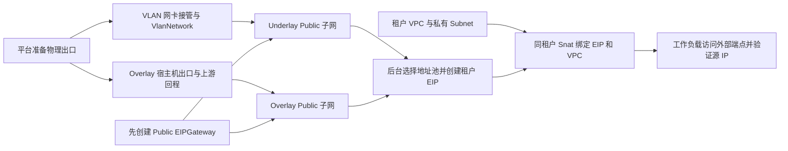

# kc 公网出网操作手册

日期：2026-09-10。面向 Network 平台管理员及租户初始化操作者。第 0 节是产品接口操作顺序；后续 kc 命令是 Provider 字段与只读核对参考，不可用于绕过产品链路验收。

本文以 kc 源码 `a2245883eb2b46a998f041feb3ad0ed3f6cf7c60` 为准；Network 输入为 `e481e968d3cc2f17bc4c6a736c438428519b09a0`。旧附件只作示意。本文是 [租户 VPC SNAT 方案](specs/vpc-snat.md)的操作附录；产品规则以方案为准，当前执行结果见[执行状态](execution/status.md)。

**2026-09-10 实测补充：Overlay 原始新建/重新启用流程失败，kc 新网关缓存漏填 serviceIP，ER 源路由下一跳为空；手工只补测试下一跳后的双 worker HTTPS 对照成功。Underlay 尚未实测。** 完整记录见 [Overlay 实测](execution/records/KC-OVERLAY-20260910T114200Z/README.md)。后续原始流程验收须先取得修复后的 kc 版本；不能照此手册创建出 Bound CR 就宣称可以出网。本轮 Network 实现未重跑原生 Overlay 数据面；用户明确要求只标注 kc 缺陷，不修复或升级 kc。

Network 的 [原 RPC](../api/network/v1/network.proto) 提供 VPC/Subnet/Attachment；[出网 RPC](../api/network/v1/egress.proto) 增加独立平台管理与租户 EIP/SNAT 服务。正式运行进程已注册服务，出网权限默认拒绝，需要可信入口注入授权上下文；受控测试通过不代表真实 IAM 或 ANI Gateway 已接通。不要手建 EIP/Snat 冒充产品受理结果，不修改已有对象的映射或归属标签。

## 0. Network 产品接口操作顺序

所有操作在明确的集群、独占测试服务/数据库和可信授权入口上执行。部署所需的 [RBAC 与节点事实采集器](../deployments/egress/README.md) 独立说明权限、节点 UID 固定和停止方式。普通 RPC 请求中的 `target_tenant_id` 不能授予身份；未提供时使用可信租户上下文，指定其他租户需要单独代操作许可。`PlatformNetworkService` 的管理员权限不自动包含租户代操作权限。当前 ANI Gateway/OpenAPI 接线不在本轮。

1. **读取事实。** Underlay 管理员调用 `ListNodeInterfaces`，记录完整 `inventory_fingerprint`、节点 UID、事实时间和不可用原因；本轮只做自动测试，不能对真实网卡执行下一步。Overlay 跳过网卡和 VLAN 接管。
2. **平台初始化。** Underlay 调用 `AdoptNetworkDevice`，等待 `GetNetworkDevice` 的各节点进度，再调用 `CreateVlanNetwork`，其中 `vlan_id=0` 是 untagged。两种模式都调用 `CreateEgressGateway`，等待资源 `available` 且观测新鲜，再调用 `CreatePublicAddressPool`。请求使用产品网关/VLAN ID，不能提交底层 namespace 或 Public CR 名。
3. **记录验收并开放。** `GetPublicAddressPool` 返回当前 `topology_fingerprint` 与 `observed_provider_images`。具备该池/网关配置、实际镜像和模式范围的有效现场验收依据后，管理员调用 `RecordPublicPoolVerification`，提供完整源码 revision、实际 SHA-256 镜像 digest、该 fingerprint、证据引用、范围、验证及到期时间。再以最新 `expected_version` 和独立幂等键调用 `SetPublicPoolAllocationEnabled(enabled=true)`，并调用 `SetDefaultPublicPool`。只有 CR Ready 或历史手改 OVN 对照结果时，不能填写虚构验收记录；新池保持关闭。受控测试中的 fixture 证据只适用于该测试依赖。
4. **租户私网与地址。** 通过既有 `NetworkService` 创建 VPC/Subnet；调用 `TenantEgressService.CreateEIP` 只提供名称、描述和幂等键。保存返回的产品 ID 与 operation ID，以 `GetEIP` 等待已分配地址。租户接口不暴露池配置，分配重试始终使用首次持久选定的池。
5. **绑定与启停。** `BindVPCSnat(vpc_id,eip_id,idempotency_key)` 返回不可变 binding ID。用 `GetVPCSnatBinding` 等待 `applied_enabled=true`；`SetVPCSnatEnabled` 带该 ID、目标 enabled、最新 version 和永久幂等键。受理时 applied 值为空；停用完成后为显式 false，绑定及 EIP 继续占用。父 EIP 的持续观察也须恢复就绪后再发起重新启用；过渡中可返回出口未就绪。
6. **解绑与释放。** `DeleteVPCSnatBinding(binding_id)` 后等待资源 deleted，确认 EIP 回到 unbound；需要释放地址时再 `DeleteEIP(eip_id)`。关闭池分配不会删除已有 EIP。平台退役依次关闭分配、释放全部 EIP/其他消费者、删除池、删除网关或 VLAN。VLAN 删除不自动归还物理网卡；部分接管不覆盖共享 `managedDevices` 回滚。
7. **操作查询。** 租户通过已有 `GetOperation` 查询本租户 EIP/SNAT 操作；平台通过 `GetPlatformOperation` 查询独立平台操作。永久幂等重放返回原受理快照；查看当前状态使用 Get。查询不访问 Kubernetes，也不启动外部变更。

完整字段与错误以生成的 Proto 为准。`scripts/snat-remote -- scripts/integration -p 2 -run 'TestEgress|TestNodeFactsCollector' ./internal/data` 可在 ubuntu 重放受控接口、实际 adapter、PG、Underlay 合同及服务崩溃恢复测试；不创建 live EIP/Snat，不执行物理接管。正式 Overlay 复测仍须满足[计划中的前置条件](plans/vpc-snat.md#3-overlay-复测入口)，并使用上述产品入口完成全过程。


## 1. 资源、模式与依赖顺序

| 用户操作 | kc 对象或配置 | 作用域及归属 |
|---|---|---|
| 管理员查询候选网卡 | 节点实际 link/address/route/OVS 事实；ListNodeInterfaces | 平台；按节点返回 |
| 管理员接管物理网卡 | `kcn-system/kcn-config.data.managedDevices` | 平台系统配置 |
| 管理员创建 VLAN 二层网络 | `VlanNetwork`，`vlanID: 0–4094` | Cluster；不填 namespace |
| 管理员配置公网网关 | `EIPGateway`，`scope: Public` | Cluster；不填 namespace |
| 管理员创建公网地址池 | `Subnet`，`type: Public` | 固定 `kcn-system` |
| 租户创建私有网络 | `VPC`、`Subnet(type: VPC)` | 所属租户 namespace |
| 租户申请公网 IP | `EIP` | 所属租户 namespace；引用平台 Public 子网 |
| 租户为 VPC 开启公网出口 | `Snat` | 与 EIP、VPC 相同的租户 namespace |

本文采用以下产品术语：

| 模式 | 配置与数据路径 |
|---|---|
| VLAN 模式 / Underlay Public | 创建 VlanNetwork；0 表示不打 VLAN tag，1–4094 表示带 tag。Public 子网填写 `underlayConfig`，经物理二层网和交换机网关出网。 |
| 非 VLAN 模式 / Overlay Public | 不创建该出口专用的 VlanNetwork，不填写 `underlayConfig`；通过 OVN/OVS 逻辑网络及 Geneve 承载，当前出口方式是经宿主机转发。仍然需要承载隧道和宿主机出网的物理网络。 |

**EIPGateway 没有 `type: Overlay/Underlay` 字段。** 两种 Public 子网都引用 `scope: Public` 的 EIPGateway；是否 underlay 由子网决定。同一 EIPGateway 的实现会处理这两类子网，本文使用一个 `public-egress` 演示，不因模式不同强制创建两个网关。

`egressType: Host` 描述 overlay 出口方式；对 underlay 子网，代码另生成经 `underlayConfig.gatewayIP` 的策略路由。本文不使用 `egressType: Gateway`，也不填写其尚未实现的 `gatewayConfig`。[网关 schema][kc-gw-type]、[网关策略][kc-gw-policy]。



执行顺序是：公共前置检查 → VLAN 分支的网卡与二层网络（Overlay 跳过）→ EIPGateway → 相应 Public 子网 → 租户 VPC/Subnet → EIP → Snat → 实际流量。两个 Public 分支可以分别初始化，但同一测试 VPC 每次只绑定一个全 VPC 出口 Snat，避免重叠规则干扰验证。

## 2. 环境输入与公共前置检查

以下命令在同一个 Bash 会话中执行，需要 `kubectl`、`jq`。先填写 context；所有后续 Kubernetes 操作均通过函数 `kc` 固定 context，不依赖默认集群。

```bash
KC_CONTEXT=''  # 必填：运行目标 kc 版本的集群 context
: "${KC_CONTEXT:?先填写 KC_CONTEXT}"
kc() { kubectl --context="${KC_CONTEXT:?}" "$@"; }
KC_SYSTEM_NS='kcn-system'
KC_EIP_GW='public-egress'

kc get nodes -o wide
kc get namespace "$KC_SYSTEM_NS"
kc get pods -n "$KC_SYSTEM_NS" -o wide
kc get configmap kcn-config -n "$KC_SYSTEM_NS" -o json \
  | jq '{namespace:.metadata.namespace,name:.metadata.name,data:.data}'
kc get crd vlannetworks.networking.kubercloud.com \
  eipgateways.networking.kubercloud.com subnets.networking.kubercloud.com \
  vpcs.networking.kubercloud.com eips.networking.kubercloud.com \
  snats.networking.kubercloud.com
kc get subnets.networking.kubercloud.com -A
kc get eipgateways.networking.kubercloud.com
kc get subnets.networking.kubercloud.com sys-service -n "$KC_SYSTEM_NS" -o yaml
```

必须确认目标部署的 CRD、controller、CNI/daemon 和 OVN/OVS 就绪，`sys-service` 已初始化。源码的系统 namespace 默认是 `kcn-system`，可由 `KUBE_NAMESPACE` 改写；本文固定采用用户指定的 `kcn-system`。手动创建 Public 子网仍要显式填写 `metadata.namespace`：Kubernetes 不会把误建在其他 namespace 的 CR 自动搬过来。[系统 namespace][kc-system-ns]。

| 输入 | 如何取值 |
|---|---|
| Underlay Public CIDR | 网络管理员分配给该物理 VLAN/无 tag 网络的真实地址段；与交换机接口地址一致，不能随意编造。 |
| Overlay Public CIDR | 网络管理员分配、能够路由回 kc 节点的地址段；不要求与节点物理口在同一二层，但必须有明确回程。 |
| Public CIDR 冲突检查 | 两种公网池彼此不得重叠，也应避开节点、Service CIDR、kc `sys-service/sys-uplink`、现有公网池等基础设施地址范围。确认 `intranetNetworks` 的分类不会把本次公网测试目标送往内网出口。 |
| 公网池使用私网地址 | 可作为测试出口池，但需要上游另有明确的 NAT 与回程。仅把私网 CIDR 标为 Public，不会自动成为公网可路由地址。 |
| `intranetNetworks` | 保持现有真实 IDC/内部网络清单；它影响目的路由，不能为了公网连通直接清空或填 `0.0.0.0/0`。Public EIP 不代表自动取得这些内网目的的访问能力。 |
| `encapNetworks` | kc 用于选择 Geneve 隧道端点的节点网络；Overlay 依赖它，但它不是公网 EIP 池，也不等于 `managedDevices`。 |
| 私有 VPC/Subnet CIDR | 从租户网络规划取值；Subnet 必须在父 VPC CIDR 内。同一 VPC 内子网不重叠。 |

本文示例中的 `198.51.100.0/24`、`203.0.113.0/24` 仅用于解释字段，属于文档地址，不可作为真实公网输入。命令将真实出口地址变量留空，填写完成后才能继续。

## 3. 平台管理员：VLAN 模式的网卡查询和二层初始化

Overlay 模式跳过本节，不为了 Overlay 公网再接管一块物理网卡。

### 3.1 查询候选网卡

管理员 ListNodeInterfaces 返回：节点、接口名、接口类型、MAC、MTU、链路状态、IP 地址、master/OVS 占用、是否已被 kc 接管、是否可选、不可选原因、观测时间。不要把 `Node.status.addresses` 当成完整网卡列表。

在每个 Kubernetes 节点的宿主网络环境读取以下事实；kind 场景应进入相应 kind 节点的网络环境，不能拿外层 VM 的同名网卡当成节点网卡：

```bash
ip -j -d link show
ip -j address show
ip -j route show table all
ovs-vsctl show
ovs-vsctl get Open_vSwitch . external_ids:ovn-bridge-mappings
```

最后两条在该节点实际的 OVS 运维环境执行；有些部署需进入 OVS 容器。不要假定 API 所在机器就是网络节点。

| 筛选项 | 代码实际要求 / 产品补充检查 |
|---|---|
| 同名网卡 | 当前配置对所有节点生效，没有本流程可用的 VlanNetwork nodeSelector；按全部节点的同名候选交集选择。 |
| 地址占用 | kc 的 `HasIPAddress` 拒绝有非 link-local IP 的接口。实际实现跳过 `IsLinkLocalUnicast()` 地址，不能仅按注释理解为只跳过 IPv6。 |
| 链路 | kc 会尝试将接口设为 UP；UP 不证明交换机链路或 VLAN 已正确连接，还应检查 carrier 和交换机配置。 |
| 已有用途 | 产品应排除 loopback、管理/默认路由接口、隧道接口、veth，以及被其他 bridge/bond/系统占用的候选；这些是产品接管检查，不能宣称 kc 已完整实现。 |
| 已由 kc 接管 | 可以只读展示其 `br-<devName>`、现有 VlanNetwork 和占用子网；不得当成空闲口重复破坏性接管。 |

[kc 网卡接管][kc-device-adopt]、[地址过滤][kc-device-filter]。当前 `networking.kubercloud.com/managed_netdevs` annotation 只反映已接管设备的布尔状态，不是完整候选网卡发现接口。

### 3.2 将选定网卡加入 managedDevices

```bash
KC_DEV=''       # 例如 ens224，必须在全部目标节点存在且满足上表
KC_VLAN_ID=''   # 0：不打 tag；1–4094：交换机已配置的 VLAN ID
KC_VLAN='public-uplink'
: "${KC_DEV:?先选择网卡}"
: "${KC_VLAN_ID:?填写 0 到 4094 的 VLAN ID}"

kc get configmap kcn-config -n "$KC_SYSTEM_NS" -o json > kcn-config.before.json
jq --arg dev "$KC_DEV" '
  def trim: gsub("^\\s+|\\s+$"; "");
  {metadata:{resourceVersion:.metadata.resourceVersion},
   data:{managedDevices:([((.data.managedDevices // "") | split(",")[] | trim | select(length>0)), $dev] | unique | join(","))}}
' kcn-config.before.json > managed-devices.patch.json
cat managed-devices.patch.json
kc patch configmap kcn-config -n "$KC_SYSTEM_NS" \
  --type=merge --patch-file=managed-devices.patch.json
```

这一步保留其他受管网卡及其他 ConfigMap 配置；`resourceVersion` 冲突时重新读取、核对后生成 patch。不要把 `managedDevices` 覆盖成只剩新网卡，也不要直接重放旧备份覆盖其他管理员的新配置。

查看所有节点反馈，并在节点 OVS 环境确认 `br-$KC_DEV`、物理口以及 `net.$KC_DEV:br-$KC_DEV` mapping：

```bash
kc get nodes -o json | jq '.items[] | {
  node:.metadata.name,
  managed:(.metadata.annotations["networking.kubercloud.com/managed_netdevs"] // "{}" | fromjson)
}'
```

### 3.3 创建 VlanNetwork

```bash
cat > vlan-network.yaml <<EOF
apiVersion: networking.kubercloud.com/v1
kind: VlanNetwork
metadata:
  name: ${KC_VLAN}
spec:
  vlanID: ${KC_VLAN_ID}
  devName: ${KC_DEV}
EOF
kc apply --dry-run=server -f vlan-network.yaml
kc apply -f vlan-network.yaml
kc wait --for=condition=Ready --timeout=180s \
  "vlannetworks.networking.kubercloud.com/$KC_VLAN"
kc get vlannetworks.networking.kubercloud.com "$KC_VLAN" -o json \
  | jq '{spec,status}'
```

要求 `Valid=True`、`Ready=True`、`notReadyNodes` 为空。`vlanID` 与 `devName` 不可变；一个 VlanNetwork 当前只允许一个 Subnet 占用。同一物理接口可承载不同 VLAN，但相同物理口和相同 VLAN ID 不应创建多个互相冲突的独立出口网络。[二层 schema][kc-vlan-type]、[子网独占绑定][kc-vlan-bind]。

## 4. 平台管理员：先创建 Public EIPGateway

两条分支均执行本节。网关不从 Public 子网分配自身互联地址，依赖的是 kc 已初始化的 `sys-service` 子网，因此可以且应先于 Public 子网创建。

```bash
cat > eip-gateway.yaml <<EOF
apiVersion: networking.kubercloud.com/v1
kind: EIPGateway
metadata:
  name: ${KC_EIP_GW}
spec:
  scope: Public
  egressType: Host
EOF
kc apply --dry-run=server -f eip-gateway.yaml
kc apply -f eip-gateway.yaml
kc wait --for=condition=Ready --timeout=180s \
  "eipgateways.networking.kubercloud.com/$KC_EIP_GW"
kc get eipgateways.networking.kubercloud.com "$KC_EIP_GW" -o json \
  | jq '{spec,status}'
```

| 字段 | 取值规则 |
|---|---|
| `metadata.namespace` | 不填：EIPGateway 是 Cluster 资源。 |
| `scope` | 本目标固定 `Public`；当前 CRD 只接受 Public。 |
| `egressType` | 固定 `Host`。它不把 Underlay Public 子网改成 Overlay。 |
| `hostConfig` | 本文省略；代码支持自动从系统服务地址池分配互联 IP。 |
| `hostConfig.localIP` | 如确有固定互联 IP 需求，取 `sys-service` 实际用于 IPAM 的内部半区中的未占用地址；它不是公网 EIP、交换机 IP 或节点管理 IP。不掌握系统地址分区时保持省略。 |
| `status.localIP` | kc 已分配的服务互联地址，供排障读取；不由操作者写入。 |
| `gatewayConfig` | 不填；专用 Gateway 模式未实现，不属于本手册流程。 |

要求 Valid/Initialized/Ready 均为 True，`status.boundResources.router` 和 `status.localIP` 非空。[实际互联分配][kc-gw-connect]、[系统地址池分区][kc-ipam]。若同名网关已存在，先核对归属与配置再决定复用，不能直接覆盖未知对象。

## 5. 平台管理员：创建 Public 子网

### 5.1 分支 A：Underlay / VLAN Public 子网

前置：第 3 节 VlanNetwork 已就绪，第 4 节 EIPGateway 已就绪；交换机端口的 tag/native VLAN 与 `KC_VLAN_ID` 一致，外部网关能够转发并接收返回流量。

```bash
UL_PUBLIC_CIDR=''      # 真实物理公网段；说明示例 198.51.100.0/24
UL_OVN_GATEWAY_IP=''   # 本段中为 OVN 保留的地址；说明示例 198.51.100.1
UL_SWITCH_GATEWAY_IP='' # 实际交换机/路由器接口；说明示例 198.51.100.254
UL_RESERVED_RANGE=''   # 其他已占用或保留地址范围；格式示例 198.51.100.1..198.51.100.20
: "${UL_PUBLIC_CIDR:?填写物理公网 CIDR}"
: "${UL_OVN_GATEWAY_IP:?填写 OVN 侧地址}"
: "${UL_SWITCH_GATEWAY_IP:?填写交换机侧网关}"
: "${UL_RESERVED_RANGE:?填写至少一项真实保留地址或范围}"
: "${KC_VLAN:?先完成 VLAN 分支}"

cat > public-underlay.yaml <<EOF
apiVersion: networking.kubercloud.com/v1
kind: Subnet
metadata:
  name: public-underlay
  namespace: ${KC_SYSTEM_NS}
spec:
  type: Public
  ipVersion: IPv4
  allowedNamespaces:
    from: All
  gateway: ${KC_EIP_GW}
  cidrBlock: ${UL_PUBLIC_CIDR}
  gatewayIP: ${UL_OVN_GATEWAY_IP}
  excludeIPs:
    - ${UL_OVN_GATEWAY_IP}
    - ${UL_SWITCH_GATEWAY_IP}
    - ${UL_RESERVED_RANGE}
  underlayConfig:
    vlanNetwork: ${KC_VLAN}
    gatewayIP: ${UL_SWITCH_GATEWAY_IP}
  enableDHCP: false
EOF
kc apply --dry-run=server -f public-underlay.yaml
kc apply -f public-underlay.yaml
kc wait --for=condition=Ready --timeout=180s \
  subnets.networking.kubercloud.com/public-underlay -n "$KC_SYSTEM_NS"
kc get subnets.networking.kubercloud.com public-underlay -n "$KC_SYSTEM_NS" -o json \
  | jq '{spec,status}'
```

| 重点字段 | 如何取值 |
|---|---|
| `gateway` | EIPGateway 名称，例如 `public-egress`，不是 IP，也不加 `kcn-system/`。 |
| `gatewayIP` | OVN 在 Public 子网内使用的网关接口地址；必须在 `cidrBlock` 内，且不能与交换机侧网关相同。 |
| `underlayConfig.gatewayIP` | 物理交换机/路由器在这个子网的真实接口 IP；也是 kc 生成源地址策略路由的下一跳。 |
| `underlayConfig.vlanNetwork` | 第 3 节创建的 Cluster VlanNetwork 名称；vlanID=0 也必须填。 |
| `excludeIPs` | 单 IP 或 `起始IP..结束IP`；登记交换机、OVN、现有设备及保留地址，避免 IPAM 分给租户。示例中的重复排除是允许的。 |
| `enableDHCP` | 本子网只作为 EIP 地址池时取 false；不是租户虚拟机所在的私有子网。 |
| `natOutgoing` | 省略；它不是普通租户 VPC 的公网开关，也不能替代 Snat。 |

除 Valid/Initialized/Ready 外，还需检查 `status.underlayState.ready=true`、`notReadyNodes` 为空、`chassisNode` 非空，且 VlanNetwork 的 `status.subnet` 指向 `kcn-system/public-underlay`。仅 Subnet Ready 不能代替物理网络就绪。[Underlay 下发][kc-underlay-apply]、[Underlay 状态同步][kc-underlay-state]。

### 5.2 分支 B：Overlay / 非 VLAN Public 子网

前置：第 4 节 EIPGateway 已就绪；节点已有工作的 OVN/OVS、Geneve 网络和宿主机出口。**不执行网卡接管，不填写 `underlayConfig: {}`；整个字段都省略。**

```bash
OL_PUBLIC_CIDR=''       # 分配给 Overlay 出口的真实可路由地址段
OL_OVN_GATEWAY_IP=''    # 本段内为 OVN 保留的地址
OL_RESERVED_RANGE=''    # 本段保留地址或范围
: "${OL_PUBLIC_CIDR:?填写 Overlay 公网 CIDR}"
: "${OL_OVN_GATEWAY_IP:?填写本段 OVN 侧地址}"
: "${OL_RESERVED_RANGE:?填写至少一项真实保留地址或范围}"

cat > public-overlay.yaml <<EOF
apiVersion: networking.kubercloud.com/v1
kind: Subnet
metadata:
  name: public-overlay
  namespace: ${KC_SYSTEM_NS}
spec:
  type: Public
  ipVersion: IPv4
  allowedNamespaces:
    from: All
  gateway: ${KC_EIP_GW}
  cidrBlock: ${OL_PUBLIC_CIDR}
  gatewayIP: ${OL_OVN_GATEWAY_IP}
  excludeIPs:
    - ${OL_OVN_GATEWAY_IP}
    - ${OL_RESERVED_RANGE}
  enableDHCP: false
EOF
kc apply --dry-run=server -f public-overlay.yaml
kc apply -f public-overlay.yaml
kc wait --for=condition=Ready --timeout=180s \
  subnets.networking.kubercloud.com/public-overlay -n "$KC_SYSTEM_NS"
kc get subnets.networking.kubercloud.com public-overlay -n "$KC_SYSTEM_NS" -o json \
  | jq '{spec,status}'
```

此处 `gatewayIP` 仍是 OVN 子网接口，不是宿主机默认网关。`underlayConfig` 不存在，`status.underlayState` 应为空；不能用 `vlanID: 0` 表达 Overlay。

**还必须完成下面这段 CR 之外的物理路由闭合：**

| 链路 | 谁负责、如何核对 |
|---|---|
| VPC → SNAT EIP → EIPGateway | kc 根据 EIP/Snat 创建逻辑路由、NAT 及出口节点策略。 |
| EIPGateway → 节点 `ovn0` → 宿主机上游 | kc 建立逻辑/节点路由；管理员核对实际出口节点的 IP forwarding、路由、上游过滤及出口链路。 |
| 上游 → Overlay Public CIDR → kc 节点 | 网络管理员设置返回该 CIDR 的路由。下一跳是上游可达的 kc 节点上联 IP或经验证的路由入口，不是 `OL_OVN_GATEWAY_IP` 或 `EIPGateway.status.localIP`。 |
| 节点 → EIPGateway → EIP 对应 VPC/工作负载 | kc daemon 为 EIPGateway 的子网下发节点路由，控制器为 EIP 下发目标路由；读取实际节点路由和 EIP 绑定事实核对。 |

例如，上游 Linux 路由器上的目标路由应具有“`真实 Overlay Public CIDR via 上游可直达的 kc 节点 IP`”的含义。具体下一跳、多个节点的路由发布和故障切换由现场网络拓扑确定，本手册不冒称 kc 会自动配置物理路由器或提供已验收的 HA。

若使用私有 Overlay EIP 地址池，上游还需对该源地址池做明确 NAT，返回路径必须能经过对应有状态设备。此时互联网看到的源 IP 是上游 NAT 的出口地址，不一定是 EIP。若要求互联网直接看到 EIP，就使用真实可路由地址池并避免额外改写源地址。

当前代码不能支持“随便建一个 Overlay Public 私网池，凭宿主机能上网就自动完成公网 NAT”这一结论。`natOutgoing` 的节点 MASQUERADE 管理只用于默认 VPC 子网。[逻辑出口路由][kc-gw-policy]、[节点返回路由][kc-node-route]、[natOutgoing 范围][kc-nat-outgoing]。

### 5.3 将地址池提供给租户申请

两类 Public 子网均固定 `allowedNamespaces.from: All`，并统一保留在 `kcn-system`。这个字段允许 kc 跨 namespace 使用资源，不控制 Network 的管理员/租户接口可见性。

Network 应隐藏 Public Subnet 的列表、拓扑与 CR 引用；租户只发起“申请 EIP”。后台选择该集群显式配置、开放新分配且具有新鲜验收/就绪证据的默认 Public 池，再将 `kcn-system/<pool-name>` 写入 EIP。多池选择规则属于产品配置，不让租户提交任意 `spec.subnet`。容量耗尽、池未就绪或出口未配置时返回可识别的失败，不能把“创建了 CR”算作已分配。

## 6. 租户侧：准备 VPC 和私有 Subnet

产品使用中由 Network 创建并保存租户资源与 Provider 映射，实例 owner 负责创建工作负载。以下 YAML 只用于独立手动验证；如果复用既有产品 VPC/Subnet，读取其已持久化的实际 namespace/name，跳过创建步骤，不重写现有对象。

| 身份/字段 | 本次确认的规则 |
|---|---|
| 普通租户 API 未传 `tenant_id` | 从当前已授权的活动租户上下文补齐；没有明确租户上下文则拒绝。 |
| 管理员显式传 `tenant_id` | 先验证管理员代办权限，再使用目标租户的持久 namespace 映射初始化资源；资源 owner 是目标租户。 |
| 操作人与直接调用方 | 独立记录 Actor/Direct Caller；不把管理员身份当成资源 tenant_id。 |
| Network 内部 RPC | 仍传显式非空 tenant_id，遵循[当前身份契约](specs/vpc-subnet.md#22-身份与租户输入)。 |
| EIP、Snat、VPC、私有 Subnet | 强制属于同一目标租户 namespace；引用资源时同时校验 tenant_id 和持久化对象映射。namespace 名或客户端字段本身不构成授权。 |

```bash
TENANT_ID=''   # 必填：资源所属租户 UUID；管理员代办时是目标租户
: "${TENANT_ID:?填写目标租户 UUID}"
TENANT_NS="tenant-${TENANT_ID}" # 仅新建测试租户按此示例；产品使用已保存的映射
VPC_NAME='vpc-egress-manual'
PRIVATE_SUBNET='subnet-egress-manual'
PRIVATE_VPC_CIDR='10.240.0.0/16' # 按现场租户规划修改
PRIVATE_SUBNET_CIDR='10.240.1.0/24'
PRIVATE_GATEWAY_IP='10.240.1.1'
```

先检查 namespace 是否存在。已存在则核实它确属目标租户后复用；仅对确认不存在的新测试 namespace 执行创建：

```bash
kc create namespace "$TENANT_NS"
```

VPC 与 Subnet 分步创建，先等待父 VPC 就绪：

```bash
cat > tenant-vpc.yaml <<EOF
apiVersion: networking.kubercloud.com/v1
kind: VPC
metadata:
  name: ${VPC_NAME}
  namespace: ${TENANT_NS}
spec:
  ipVersion: IPv4
  cidrBlock: ${PRIVATE_VPC_CIDR}
  allowedNamespaces:
    from: Same
EOF
kc apply --dry-run=server -f tenant-vpc.yaml
kc apply -f tenant-vpc.yaml
kc wait --for=condition=Ready --timeout=180s \
  "vpcs.networking.kubercloud.com/$VPC_NAME" -n "$TENANT_NS"

cat > tenant-subnet.yaml <<EOF
apiVersion: networking.kubercloud.com/v1
kind: Subnet
metadata:
  name: ${PRIVATE_SUBNET}
  namespace: ${TENANT_NS}
spec:
  type: VPC
  ipVersion: IPv4
  gateway: ${VPC_NAME}
  cidrBlock: ${PRIVATE_SUBNET_CIDR}
  gatewayIP: ${PRIVATE_GATEWAY_IP}
  allowedNamespaces:
    from: Same
  enableDHCP: false
EOF
kc apply --dry-run=server -f tenant-subnet.yaml
kc apply -f tenant-subnet.yaml
kc wait --for=condition=Ready --timeout=180s \
  "subnets.networking.kubercloud.com/$PRIVATE_SUBNET" -n "$TENANT_NS"
kc get vpcs.networking.kubercloud.com "$VPC_NAME" -n "$TENANT_NS" -o yaml
kc get subnets.networking.kubercloud.com "$PRIVATE_SUBNET" -n "$TENANT_NS" -o yaml
```

VPC 自身没有 `spec.type`；只有私有 Subnet 填 `type: VPC`。私有子网的 `gateway` 是父 VPC 名，而 Public 子网的同名字段是 EIPGateway 名。两类引用不要混用。私有子网不得带 `underlayConfig`，也不通过开启 `natOutgoing` 取得公网。

这里的 DHCP=false 适用于后续普通容器验证。VM 若依赖 DHCP，还需要私有子网 DHCP、VNicIP 等完整接入配置，不能从此容器流程推导 VM 已验收。创建后检查 Valid/Initialized/Ready、`observedGeneration` 与当前 generation、父子引用及实际 OVN 资源字段。

## 7. 租户侧：申请 EIP

选择已初始化的一条路径。手工操作模拟后台选池；真实租户 API 不应暴露这个选择用的 CR 字段。

```bash
EGRESS_MODE='overlay' # 取 overlay 或 vlan；本次只测试一种
case "$EGRESS_MODE" in
  overlay) PUBLIC_POOL='public-overlay' ;;
  vlan) PUBLIC_POOL='public-underlay' ;;
  *) echo 'EGRESS_MODE 必须为 overlay 或 vlan' >&2; return 1 2>/dev/null || exit 1 ;;
esac
EIP_NAME="eip-${TENANT_ID}-${EGRESS_MODE}-01"
SNAT_NAME="snat-${TENANT_ID}-${EGRESS_MODE}-01"

kc get subnets.networking.kubercloud.com "$PUBLIC_POOL" -n "$KC_SYSTEM_NS" -o json \
  | jq -e '.spec.type=="Public" and .spec.allowedNamespaces.from=="All"'
kc get eips.networking.kubercloud.com -A -o json \
  | jq --arg name "$EIP_NAME" '[.items[] | select(.metadata.name==$name) | {namespace:.metadata.namespace,name:.metadata.name}]'
```

新申请要求查询结果为空；有同名对象则先明确它的归属，不覆盖、不借用。本文对象名携带完整租户 UUID 与路径后缀，使 Provider 名称全局唯一；产品实现应使用全局唯一资源 ID 生成 CR 名，不用显示名称直接生成 `eip1`。

```bash
cat > tenant-eip.yaml <<EOF
apiVersion: networking.kubercloud.com/v1
kind: EIP
metadata:
  name: ${EIP_NAME}
  namespace: ${TENANT_NS}
spec:
  subnet: ${KC_SYSTEM_NS}/${PUBLIC_POOL}
  ipVersion: IPv4
EOF
kc apply --dry-run=server -f tenant-eip.yaml
kc apply -f tenant-eip.yaml
kc wait --for=condition=Valid --timeout=180s \
  "eips.networking.kubercloud.com/$EIP_NAME" -n "$TENANT_NS"
kc wait --for=jsonpath='{.status.phase}'=Available --timeout=180s \
  "eips.networking.kubercloud.com/$EIP_NAME" -n "$TENANT_NS"
EIP_ADDRESS="$(kc get eips.networking.kubercloud.com "$EIP_NAME" -n "$TENANT_NS" -o jsonpath='{.spec.ipAddress}')"
: "${EIP_ADDRESS:?kc 尚未分配地址}"
kc get eips.networking.kubercloud.com "$EIP_NAME" -n "$TENANT_NS" -o json \
  | jq '{namespace:.metadata.namespace,name:.metadata.name,spec,status}'
```

重点：`subnet` 必须是 `kcn-system/<Public池名>`；`ipAddress` 省略后由 kc IPAM 分配，结果写回 **`spec.ipAddress`**。不要从不存在的 `status.ipAddress` 取值。指定 IP 申请如需开放，后台必须检查它属于选定池、未排除且未占用；它不能用于修改已有 EIP 地址。

申请完成要求 `Valid=True`、`Initialized=True`、`phase=Available`、地址非空且属于所选池、`status.gateway` 等于本次 EIPGateway、`boundResource` 为空。此时仅持有公网地址，尚未为 VPC 打开出口。[EIP 分配与状态][kc-eip-allocate]。

**同 namespace 是必要规则，但不是当前 Provider 缺口的修复。** 此源码的 EIP `selectBoundObj` 按裸 EIP 名跨 namespace 查 Nat/Snat，未传 `client.InNamespace`；Snat 对 VPC 也接受跨 namespace 引用。产品应强制同租户/同 namespace，并使用全局唯一 Provider 名称降低碰撞风险；kc 的查询隔离仍应修正、补跨租户同名负例后再给出隔离验收结论。`allowedNamespaces: All` 也不是只允许分配 EIP 的细粒度授权，不能因此向租户开放任意 CR 写权限。[EIP 选择逻辑][kc-eip-select]、[裸名称索引][kc-eip-index]、[Snat 校验][kc-snat-validate]。

## 8. 准备实际工作负载和绑定前对照

已经有目标 VPC/Subnet 内的实际工作负载时直接使用它。下面提供最小普通容器验证入口，不修改业务实例；Network 产品流程仍由实例 owner 创建 Pod，并走既有 Attachment 协议。

本例要求 kc 是默认 CNI、Pod 的默认接口接入目标私有子网。先核对配置；若现场通过 Multus 接入，就使用已经验证正确的默认网络/NAD 配置或现有工作负载，不临时切换整个集群的默认 CNI。[Pod 注解解释][kc-pod-network]。

```bash
kc get configmap kcn-config -n "$KC_SYSTEM_NS" -o json \
  | jq -e '(.data.isDefaultCNI // "true")=="true"'

EGRESS_PROBE_IMAGE='' # 节点可拉取/已预载的镜像，含 sh、sleep、ip、curl、nslookup；建议固定 digest
TEST_DNS_IP=''        # 经 Public 出口可访问的真实 DNS 服务器 IPv4
TEST_IP=''            # 自有或获授权公网测试端点 IPv4，不能落入 intranetNetworks
TEST_PORT='80'
TEST_PATH='/whoami'   # 与测试端点实际路径一致
TEST_DNS_NAME=''      # 可解析到测试端点的真实域名
: "${EGRESS_PROBE_IMAGE:?填写已准备的探测镜像}"
: "${TEST_DNS_IP:?填写可达 DNS}"
: "${TEST_IP:?填写公网测试端点 IP}"
: "${TEST_DNS_NAME:?填写测试域名}"
PROBE_NAME='egress-probe'
PROBE_TOKEN="egress-$(date -u +%Y%m%dT%H%M%SZ)"

cat > egress-probe.yaml <<EOF
apiVersion: v1
kind: Pod
metadata:
  name: ${PROBE_NAME}
  namespace: ${TENANT_NS}
  annotations:
    networking.kubercloud.com/subnet: ${TENANT_NS}/${PRIVATE_SUBNET}
spec:
  automountServiceAccountToken: false
  restartPolicy: Never
  hostNetwork: false
  dnsPolicy: None
  dnsConfig:
    nameservers:
      - ${TEST_DNS_IP}
  containers:
    - name: probe
      image: ${EGRESS_PROBE_IMAGE}
      imagePullPolicy: IfNotPresent
      command: ["sh", "-c", "sleep 3600"]
      resources:
        requests:
          cpu: 10m
          memory: 16Mi
        limits:
          cpu: 100m
          memory: 64Mi
EOF
kc apply --dry-run=server -f egress-probe.yaml
kc apply -f egress-probe.yaml
kc wait --for=condition=Ready --timeout=180s "pod/$PROBE_NAME" -n "$TENANT_NS"
kc exec -n "$TENANT_NS" "$PROBE_NAME" -- ip -4 address
kc exec -n "$TENANT_NS" "$PROBE_NAME" -- ip -4 route
kc get vnics.networking.kubercloud.com -n "$TENANT_NS" -o json \
  | jq '[.items[] | {name:.metadata.name,subnet:.spec.subnet,conditions:.status.conditions}]'
kc get vnicips.networking.kubercloud.com -n "$TENANT_NS" -o json \
  | jq '[.items[] | {name:.metadata.name,subnet:.spec.subnet,vnic:.spec.vNic,ip:.spec.ipAddress}]'
```

检查 Pod 默认接口 IP 属于 `PRIVATE_SUBNET_CIDR`，默认路由指向 `PRIVATE_GATEWAY_IP`，VNic/VNicIP 引用目标子网。不要用节点自身或 `hostNetwork` Pod 的连通代替租户网络验证，也不要用镜像拉取成功作为租户出网证据。

为避免默认 Cluster DNS 本身需要内网路由，本例设置 `dnsPolicy: None`。若业务必须访问 Cluster DNS，应单独解决其内网路由/访问策略；Public Snat 不自动开放配置在 `intranetNetworks` 中的目的网络。

公网测试端点应提前从独立已知正常入口确认可用；建议它根据实际 TCP peer 记录并返回 `{"source_ip":"实际源IP","token":"请求token"}`，不要只回显未经校验的 `X-Forwarded-For`。若采用别的接口格式，按它的真实契约调整下一节断言。

在尚未为这个测试 VPC 配置任何 NAT/EIP 出口时记录基线：

```bash
kc exec -n "$TENANT_NS" "$PROBE_NAME" -- \
  curl --noproxy '*' -fsS --connect-timeout 5 --max-time 10 \
  "http://${TEST_IP}:${TEST_PORT}${TEST_PATH}?token=${PROBE_TOKEN}"
```

本方案的无出口 VPC 对该外部目的应不可达。若已经可达，先查默认网络、现有 Snat/Nat/EIP、自定义路由或其他出口；不能把之后的成功归因于本次绑定。失败也要记录原因：Pod 未启动、工具缺失、测试端点故障不能算隔离对照通过。

## 9. 租户侧：创建 Snat，将 EIP 绑定 VPC

Network 接口可表达为“为 VPC 绑定 EIP/开启出网”；后台创建 Snat，而不是向 VPC spec 写一个不存在的 `eip` 字段。创建前必须校验 EIP 属于目标租户且未占用，VPC 属于同租户；实际 Provider namespace 三者一致。

```bash
kc get vpcs.networking.kubercloud.com "$VPC_NAME" -n "$TENANT_NS" -o json \
  | jq -e --arg ns "$TENANT_NS" '.metadata.namespace==$ns'
kc get eips.networking.kubercloud.com "$EIP_NAME" -n "$TENANT_NS" -o json \
  | jq -e --arg ns "$TENANT_NS" \
    '.metadata.namespace==$ns and .status.phase=="Available" and .status.boundResource==null'

cat > tenant-snat.yaml <<EOF
apiVersion: networking.kubercloud.com/v1
kind: Snat
metadata:
  name: ${SNAT_NAME}
  namespace: ${TENANT_NS}
spec:
  eip: ${EIP_NAME}
  vpc: ${VPC_NAME}
  disable: false
EOF
kc apply --dry-run=server -f tenant-snat.yaml
kc apply -f tenant-snat.yaml
kc wait --for=condition=Valid --timeout=180s \
  "snats.networking.kubercloud.com/$SNAT_NAME" -n "$TENANT_NS"
kc wait --for=jsonpath='{.status.phase}'=Bound --timeout=180s \
  "snats.networking.kubercloud.com/$SNAT_NAME" -n "$TENANT_NS"
kc wait --for=jsonpath='{.status.phase}'=Bound --timeout=180s \
  "eips.networking.kubercloud.com/$EIP_NAME" -n "$TENANT_NS"

SNAT_GENERATION="$(kc get snats.networking.kubercloud.com "$SNAT_NAME" -n "$TENANT_NS" -o jsonpath='{.metadata.generation}')"
kc get eips.networking.kubercloud.com "$EIP_NAME" -n "$TENANT_NS" -o json \
  | jq -e --arg ns "$TENANT_NS" --arg snat "$SNAT_NAME" \
    --arg vpc "$TENANT_NS/$VPC_NAME" --arg gw "$KC_EIP_GW" \
    --argjson gen "$SNAT_GENERATION" '
    .metadata.namespace==$ns and .status.phase=="Bound" and .status.gateway==$gw
    and .status.boundResource.resourceType=="Snat"
    and .status.boundResource.resource==$snat and .status.boundResource.vpc==$vpc
    and .status.boundResource.observedGeneration==$gen
    and (.status.boundResource.disabled!=true)
    and ((.status.boundResource.nodeName // "") | length>0)'
kc get snats.networking.kubercloud.com "$SNAT_NAME" -n "$TENANT_NS" -o json \
  | jq '{spec,status}'
```

| 重点字段 | 取值规则 |
|---|---|
| `spec.eip` | 实际字段名是 `eip`，不是旧附件的 `eipName`；填写同 namespace 的 EIP CR 名。 |
| `spec.vpc` | 填同 namespace 的 VPC CR 名。即使 kc 能解析跨 namespace 字符串，Network 也必须拒绝跨租户或跨 namespace 绑定。 |
| `spec.cidrs` | 本目标省略，覆盖该 VPC 全部源地址；代码生成逻辑源网段 `0.0.0.0/0` 的 SNAT。以后缩小范围时只接受该 VPC 内指定子网 CIDR，不能直接透传任意范围。 |
| `spec.disable` | 创建时 false；true 为停用，不释放 EIP，也不等于解除占用。 |
| `status.eipAddress` | Snat 看到的 EIP 地址，应等于 EIP 的 `spec.ipAddress`。 |
| EIP `boundResource.observedGeneration` | 必须等于本次 Snat 的 generation；不能只见到旧的 Bound 就宣布当前意图已生效。 |

当前 Snat 的状态是 `Pending/Bound/Disabled`，EIP 是 `Available/Bound/Failed`。不能照旧附件等待 `Associated`，也不要对 EIP/Snat 一律执行 `wait --for=condition=Ready`：本版本控制器主要通过上述条件、phase 与绑定代次表达完成。[Snat schema][kc-snat-type]、[SNAT 规则][kc-snat-rules]、[绑定状态][kc-bound-phase]。

## 10. 确认实际出网

先通过 IP 验证公网 TCP/HTTP，再验证 DNS 与域名访问。保持同一个 Pod、相同默认接口和相同测试端点，与第 8 节基线比较。

```bash
# 无上游二次 NAT 时应等于 EIP；若有明确的上游 NAT，改为已知的最终公网源地址。
EXPECTED_PUBLIC_SOURCE_IP="$EIP_ADDRESS"
kc exec -n "$TENANT_NS" "$PROBE_NAME" -- \
  curl --noproxy '*' -fsS --connect-timeout 5 --max-time 10 \
  "http://${TEST_IP}:${TEST_PORT}${TEST_PATH}?token=${PROBE_TOKEN}" \
  > egress-by-ip.json
jq -e --arg expected "$EXPECTED_PUBLIC_SOURCE_IP" --arg token "$PROBE_TOKEN" \
  '.source_ip==$expected and .token==$token' egress-by-ip.json

kc exec -n "$TENANT_NS" "$PROBE_NAME" -- nslookup "$TEST_DNS_NAME" "$TEST_DNS_IP"
kc exec -n "$TENANT_NS" "$PROBE_NAME" -- \
  curl --noproxy '*' -fsS --connect-timeout 5 --max-time 10 \
  "http://${TEST_DNS_NAME}:${TEST_PORT}${TEST_PATH}?token=${PROBE_TOKEN}" \
  > egress-by-name.json
jq -e --arg expected "$EXPECTED_PUBLIC_SOURCE_IP" --arg token "$PROBE_TOKEN" \
  '.source_ip==$expected and .token==$token' egress-by-name.json
```

| 检查 | 通过标准 |
|---|---|
| 资源链 | Public 子网 → 预期 EIPGateway；EIP → 预期 Public 池；Snat → 同租户 EIP/VPC；绑定代次一致。 |
| VLAN 分支 | VlanNetwork Ready，UnderlayState 就绪，无未就绪节点；所选出口 chassis 的网卡、tag、交换机网关工作正常。 |
| Overlay 分支 | EIPGateway、宿主机转发、上游去程/回程闭合；如有上游 NAT，明确其地址和状态归属。 |
| 实际数据面 | 目标 VPC 内 Pod 对公网测试端点有真实成功请求；端点 token 与实际源 IP 均符合预期。 |
| DNS | 指定 DNS 查询成功，域名请求成功；单纯 IP 成功不等于 DNS 已配置。 |
| 多子网范围 | 目标 VPC 若含多个子网，在各子网代表性工作负载重复测试；一个 Pod 成功不能直接当成整个 VPC 全部子网已验收。 |
| 租户边界 | 其他租户不能读/绑定该 EIP/VPC，不能利用跨 namespace 或同名对象串绑；需独立接口及 Provider 负例证据。 |

每条模式分别记录 `pass / fail / not_verified`，保留源码及运行镜像身份、context、对象 UID、generation、关键状态、命令退出码及测试端点的源 IP 证据。只记录实际执行结果；本文没有替任一路径产生运行 pass。Pod 成功也不代表 VM、HA、跨节点故障切换或大规模容量通过。

## 11. 停用、解绑与问题定位

需要临时停止出网时，可以将本次 Snat 的 `spec.disable` 改为 true；等待 Snat `Disabled`、EIP 的绑定代次更新及 `boundResource.disabled=true`，再用新的外部请求核对停用结果。已有连接和 conntrack 的收敛行为应单独观察，不从状态字段推导即时断开。

需要真正解绑并归还 EIP 占用时，删除本次 Snat，等待 EIP 回到 Available 且 `boundResource` 为空，然后再决定是否释放 EIP：

```bash
kc delete snats.networking.kubercloud.com "$SNAT_NAME" -n "$TENANT_NS"
kc wait --for=jsonpath='{.status.phase}'=Available --timeout=180s \
  "eips.networking.kubercloud.com/$EIP_NAME" -n "$TENANT_NS"
kc get eips.networking.kubercloud.com "$EIP_NAME" -n "$TENANT_NS" -o json \
  | jq -e '.status.phase=="Available" and .status.boundResource==null'
# 仅在确认不再保留此 EIP 后执行：
kc delete eips.networking.kubercloud.com "$EIP_NAME" -n "$TENANT_NS"
kc wait --for=delete --timeout=180s \
  "eips.networking.kubercloud.com/$EIP_NAME" -n "$TENANT_NS"
```

完整手动测试清理按依赖逆序进行：探测 Pod 及其 kc 网卡/IP → Snat → EIP → 本次测试私有 Subnet/VPC。平台 Public 子网、EIPGateway、VlanNetwork 和受管物理接口可能共享，不随租户清理删除；租户 namespace 也可能被其他资源共享。不强制移除 kc finalizer。若另行退役平台出口，先核对所有地址、引用及物理网卡用途，不能直接从 `managedDevices` 删除接口。

| 症状 | 首先核对 |
|---|---|
| VlanNetwork `Device is not configured` | `managedDevices` 是否包含 devName、系统 namespace 是否正确、各节点上报是否齐全。 |
| VlanNetwork 有 notReadyNodes | 对应节点同名网卡、非 link-local IP 占用、OVS 接管错误；不要删除节点地址作为自动修复。 |
| Public 子网不初始化 | `spec.gateway` 对应 EIPGateway 是否存在、scope 是否 Public、VlanNetwork 是否被其他子网占用、网关 IP 是否相同或越界。 |
| Public 子网 Ready 但 VLAN 出口不通 | `underlayState`、出口 chassis、tag/native VLAN、交换机下一跳、ARP 与物理返回路径。 |
| EIP 不分地址 | 池容量、excludeIPs、IP 冲突、Public 子网/IPAM 初始化；分配结果在 `spec.ipAddress`。 |
| EIP `Rejected Subnet access` | EIP 引用是否带 `kcn-system/`，Public 子网是否实际 `allowedNamespaces.from: All`。 |
| Snat 一直 Pending | EIP 是否 Initialized、是否被 Nat/Snat/Service 占用、VPC 是否 Initialized、同名跨 namespace 对象、EIP 控制器错误。 |
| Snat/EIP Bound 但公网不通 | 绑定代次、实际 Pod 接入、VPC 出口节点、NAT/路由、上游回程、ACL/安全组和真实测试端点。 |
| 新网关 Ready、EIP/Snat Bound，ER 源路由下一跳却为空 | 已复现的 kc `LoadGatewaySubnet` 缓存遗漏 serviceIP；读取 `EIPGateway.status.localIP`、ER 路由及固定源码对照，修复 Provider 后重测；等待 Ready 或重启控制器不能替代新网关路径修复验收。 |
| IP 可达、域名不可达 | Pod DNS 配置、DNS 服务器是否被归类到 intranetNetworks、DNS UDP/TCP 通路。 |
| 外部源地址不是 EIP | 上游是否存在额外 NAT、探测 Pod 是否走其他网卡/代理、是否误测节点或默认 VPC。 |

只读排障可先查看相应 CR 的精简 `spec/status`、`kc get events -n <资源namespace> --sort-by=.lastTimestamp`，以及实际 controller/daemon 日志。在已配置好的 OVN 运维环境按 CR 上报的 router/节点检查 `ovn-nbctl lr-nat-list <router>`、`lr-route-list <router>`、`lr-policy-list <router>`、节点路由及 OVS bridge mapping。OVN CLI 的 DB 地址需按部署配置填写；此次 kind 不提供默认 UNIX socket，实测命令使用显式数据库端点，详见记录。

产品执行和正式验收不能直写 OVN 绕过 kc。历史实测仅为定位原因，曾对本次独占源路由做单字段对照，原始流程仍记 fail，测试专属规则最终删除。清理还要检查 kc 按需保留的共享 ER；其存在可能被控制器缓存，不应为了恢复完全相同的 OVN 清单直接手删，必须记录与基线的差异。

## 12. Network 接口与底层动作对照

本表只作手动步骤到产品职责的导航。正式新增接口、持久化、一期限制和验收合同统一见 [VPC SNAT 方案](specs/vpc-snat.md)，实施顺序见 [计划](plans/vpc-snat.md)；这属于独立增量，不改写[既有首片范围](specs/vpc-subnet.md#1-目标与范围)。运行授权链和实际验证状态分别看第 0 节和执行状态。

| 操作者 | 操作 | Network 应校验和编排 |
|---|---|---|
| 平台管理员 | 获取网卡 | 各节点完整候选及不可选原因、信息时效；按第 3 节 kc 实际条件与产品占用检查过滤。 |
| 平台管理员 | 初始化二层网络 | 仅 VLAN 模式接管设备并创建 VlanNetwork；合并 managedDevices，校验节点一致性、VLAN 及占用。 |
| 平台管理员 | 初始化网关/公网池 | 先网关后子网；Public 固定 kcn-system、All；区分 Underlay 配置和 Overlay 上游路由前置条件。 |
| 租户或有代办权限的管理员 | 申请 EIP | 解析目标 tenant_id、后台选池、生成全局唯一 Provider 名称、同租户 namespace、持久化操作并观察分配结果。 |
| 租户或有代办权限的管理员 | 给 VPC 绑定 EIP | 校验 EIP 未占用和 VPC 归属，在相同 namespace 创建 Snat；幂等受理，观察双方绑定及代次。 |
| 租户或有代办权限的管理员 | 解绑/释放 | 先解除 Snat 和确认占用释放，再按意图释放 EIP；失败/恢复不能转移资源 owner。 |

产品 tenant_id、Actor、Direct Caller、Provider namespace 各有含义；Global 平台网络资源不伪装成某个租户资源。租户资源沿用 Network 的 tenant-scoped 数据访问与持久操作边界，权限接入实际状态仍以[执行状态](execution/status.md)为准。

## 源码及命令参考

以下 kc 链接固定到本文核对的 commit，属于时点源码证据；本次核对的是本地同 SHA 文件，远端链接访问取决于仓库权限。可在本地 `kc-networking` 仓库按同一路径查阅。源码未证明现场上游网络已配置。

[kc-vlan-type]: https://gitlab.changqingyun.cn/kubercloud/sdn/kc-networking/-/blob/a2245883eb2b46a998f041feb3ad0ed3f6cf7c60/api/networking/v1/vlannetwork_types.go
[kc-gw-type]: https://gitlab.changqingyun.cn/kubercloud/sdn/kc-networking/-/blob/a2245883eb2b46a998f041feb3ad0ed3f6cf7c60/api/networking/v1/eipgateway_types.go
[kc-gw-policy]: https://gitlab.changqingyun.cn/kubercloud/sdn/kc-networking/-/blob/a2245883eb2b46a998f041feb3ad0ed3f6cf7c60/internal/controller/handlers/gateway_handler.go
[kc-system-ns]: https://gitlab.changqingyun.cn/kubercloud/sdn/kc-networking/-/blob/a2245883eb2b46a998f041feb3ad0ed3f6cf7c60/internal/ctrlutils/common.go
[kc-device-adopt]: https://gitlab.changqingyun.cn/kubercloud/sdn/kc-networking/-/blob/a2245883eb2b46a998f041feb3ad0ed3f6cf7c60/internal/daemon/networking/vlan_controller.go
[kc-device-filter]: https://gitlab.changqingyun.cn/kubercloud/sdn/kc-networking/-/blob/a2245883eb2b46a998f041feb3ad0ed3f6cf7c60/internal/daemon/netdev/netlink.go
[kc-vlan-bind]: https://gitlab.changqingyun.cn/kubercloud/sdn/kc-networking/-/blob/a2245883eb2b46a998f041feb3ad0ed3f6cf7c60/internal/controller/networking/subnet_controller.go
[kc-gw-connect]: https://gitlab.changqingyun.cn/kubercloud/sdn/kc-networking/-/blob/a2245883eb2b46a998f041feb3ad0ed3f6cf7c60/internal/controller/handlers/gateway_handler.go
[kc-ipam]: https://gitlab.changqingyun.cn/kubercloud/sdn/kc-networking/-/blob/a2245883eb2b46a998f041feb3ad0ed3f6cf7c60/internal/controller/handlers/msic.go
[kc-underlay-apply]: https://gitlab.changqingyun.cn/kubercloud/sdn/kc-networking/-/blob/a2245883eb2b46a998f041feb3ad0ed3f6cf7c60/internal/controller/networking/subnet_controller.go
[kc-underlay-state]: https://gitlab.changqingyun.cn/kubercloud/sdn/kc-networking/-/blob/a2245883eb2b46a998f041feb3ad0ed3f6cf7c60/internal/controller/networking/subnet_controller.go
[kc-node-route]: https://gitlab.changqingyun.cn/kubercloud/sdn/kc-networking/-/blob/a2245883eb2b46a998f041feb3ad0ed3f6cf7c60/internal/daemon/networking/route_controller.go
[kc-nat-outgoing]: https://gitlab.changqingyun.cn/kubercloud/sdn/kc-networking/-/blob/a2245883eb2b46a998f041feb3ad0ed3f6cf7c60/internal/daemon/networking/subnet_controller.go
[kc-eip-allocate]: https://gitlab.changqingyun.cn/kubercloud/sdn/kc-networking/-/blob/a2245883eb2b46a998f041feb3ad0ed3f6cf7c60/internal/controller/networking/eip_controller.go
[kc-eip-select]: https://gitlab.changqingyun.cn/kubercloud/sdn/kc-networking/-/blob/a2245883eb2b46a998f041feb3ad0ed3f6cf7c60/internal/controller/networking/eip_controller.go
[kc-eip-index]: https://gitlab.changqingyun.cn/kubercloud/sdn/kc-networking/-/blob/a2245883eb2b46a998f041feb3ad0ed3f6cf7c60/internal/controller/handlers/indexer.go
[kc-snat-validate]: https://gitlab.changqingyun.cn/kubercloud/sdn/kc-networking/-/blob/a2245883eb2b46a998f041feb3ad0ed3f6cf7c60/internal/controller/networking/snat_controller.go
[kc-pod-network]: https://gitlab.changqingyun.cn/kubercloud/sdn/kc-networking/-/blob/a2245883eb2b46a998f041feb3ad0ed3f6cf7c60/internal/controller/core/pod_controller.go
[kc-snat-type]: https://gitlab.changqingyun.cn/kubercloud/sdn/kc-networking/-/blob/a2245883eb2b46a998f041feb3ad0ed3f6cf7c60/api/networking/v1/snat_types.go
[kc-snat-rules]: https://gitlab.changqingyun.cn/kubercloud/sdn/kc-networking/-/blob/a2245883eb2b46a998f041feb3ad0ed3f6cf7c60/internal/controller/handlers/eip_handler.go
[kc-bound-phase]: https://gitlab.changqingyun.cn/kubercloud/sdn/kc-networking/-/blob/a2245883eb2b46a998f041feb3ad0ed3f6cf7c60/internal/controller/handlers/eip_bound_res.go

`kubectl wait` 的 condition 与 JSONPath 等待方式见 [Kubernetes 命令文档](https://kubernetes.io/docs/reference/kubectl/generated/kubectl_wait/)。OVN 逻辑交换、隧道和物理网络连接背景见 [OVN 架构文档](https://www.ovn.org/support/dist-docs/ovn-architecture.7.html)；本手册具体支持范围仍以以上固定 kc 代码为准。
