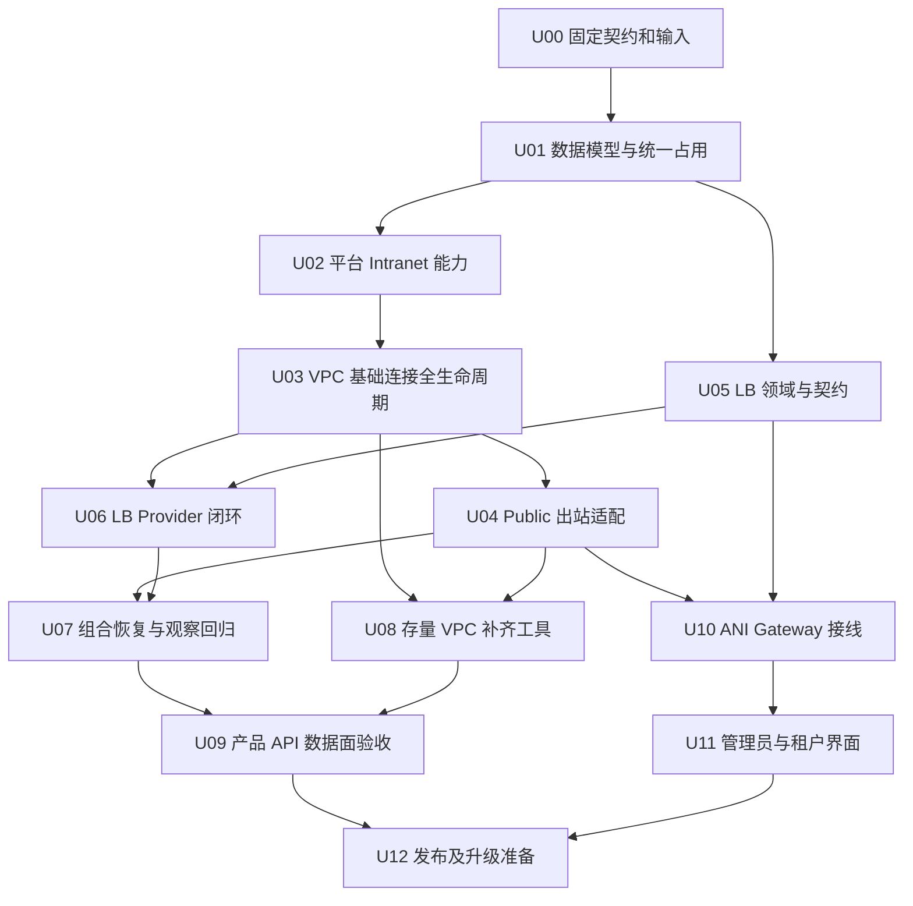

# VPC 基础连接、公网出站和 LB：可执行任务计划

日期：2026-09-14。本文只拆解[统一方案](../specs/vpc-connectivity-lb.md)，规则以方案为准；验收编号 U-V01—12 也在方案中定义。当前实施状态只维护在[执行状态](../execution/status.md)。任务未因写入本计划而开始执行。

## 1. 固定起点与实施方式

- Network 从 `d8835a22d905e358b7f60756d3113baa97d7c762` 的已实现 EIP/SNAT 基础继续；当前设计工作树为 `codex/vpc-lb-plan-20260914`，只修改文档。实施时先接入本设计文件快照，再创建独立干净实现工作树，不能直接改 main 或覆盖原 EIP/SNAT 工作树。
- ANI 当前只读参考为 `50aa9fe2099b7ff4c276f883939a8d26c9d9eff8`；这是参考时点，开始 ANI 接线任务前必须固定届时认可的基线与允许文件。不得在 Network 任务内顺带合并/部署 ANI。
- kc/Envoy 使用明确源码与镜像 digest、安装参数和集群身份；手工实验最新证据可作为回归输入，不能替代产品接口验收。kc 修复是外部前提，不在本计划写源码或自动重启工作流。
- 业务实现只在 `cmd/ani-network-service`、`internal/{biz,data,service,server}`、`api/network`、对应生成文件、`migrations`、`deployments`、必要 `scripts` 和正式 `docs` 内推进；保持本仓分层。具体任务卡继续收窄范围。
- 各任务在提交前运行必要门禁及 `make verify`，重任务优先 ubuntu，使用固定源码manifest、资源上限和独立运行目录；参考[远程执行约定](../remote-execution.md)。任务完成不自动授权提交、推送、部署或存量迁移执行。
- 每个任务交付：代码/迁移或契约、相关文档、实际命令与退出码、pass/fail/not_verified、未解决边界。不能只交 YAML renderer 或单元测试就称生命周期完成。

## 2. 任务图和阶段出口



| 阶段 | 任务 | 退出结果 |
|---|---|---|
| A：基础规则 | U00—U02 | 契约固定，数据库能防双重绑定，平台提供正确基础池 |
| B：VPC 生命周期 | U03—U04 | 新 VPC 自带基础内网连接，Public 启停/解绑不伤内网 |
| C：租户 LB | U05—U07 | 三类 LB 的受理、执行、查询、更新、删除和恢复闭环 |
| D：存量与真实验证 | U08—U09 | 可控补齐旧 VPC，产品 API 创建的组合数据面通过 |
| E：产品入口 | U10—U11 | Gateway/界面可操作，正确表达占用与健康证据 |
| F：交付准备 | U12 | 迁移/部署/回退方案可执行，是否正式执行由后续授权决定 |

U05 的纯契约/领域工作可与 U02—U04 独立准备；U10 可在契约冻结后并行开发。数据库迁移由一个任务串行负责，不能让多个分支各自改写同一历史 migration。连续重型 live 测试不并发运行。

## 3. 任务卡

### NET-U00：固定新增契约、实施输入与能力范围

- 输入：本方案、Network d8835a22、现有 Public API、LB 手工验证和附件 install。
- 修改范围：`docs/specs`、`docs/plans`、`api/network/v1` 契约及固定生成输出；业务实现不在此卡。
- 工作：固定 base_connectivity 响应、EIP binding_target 与旧字段投影、system-managed API禁止项、单 HTTP Listener 与三类型创建/更新不可变字段、管理员 Intranet 池能力。列出新增 operation/reason，明确每个 API 的输入、异步结果与幂等行为。记录 Network/ANI/Provider 固定输入和实际需修改的 API/OpenAPI 文件清单。
- 验收：契约可生成并通过固定 breaking 检查；已有 Public字段编号/含义保留；LB占用时 binding_id可空但binding_state不是unbound；新字段没有自由tenant/namespace/Provider YAML入口。将第一批协议边界记录为本次工程选择，不冒充附件全部功能完成。
- 后继：U01、U05、U10。无运行集群变更。

### NET-U01：地址池用途、系统归属和统一 EIP 占用

- 依赖：U00。
- 修改范围：新 migration、`internal/data/queries`、sqlc生成、对应 biz/data模型和真实PG测试。
- 工作：演进池scope与双默认池；EIP scope/managed_by/system_owner；SNAT purpose唯一性；基础连接步骤；LB身份/父关系的最小表；统一EIP claim；VIP意图。旧Public记录按可靠来源回填，已有SNAT生成claim，保留ID/UID/历史幂等。追加migration，不编辑0005。
- 验收：U-V03/04数据库部分；同EIP的SNAT/LB并发竞争只有一个事务成功；同VPC可一内一公但不能两条同用途；不同租户的typed FK拒绝；迁移前后旧Public读取/历史重放不变；冲突数据报告并停止，不能按名称猜归属。锁顺序与清理事务有测试。
- 后继：U02、U03、U04、U05。数据库升级测试使用独立数据库，不迁移现有环境。

### NET-U02：平台 Intranet 地址池及基础网络能力

- 依赖：U01。
- 修改范围：平台biz/service、kc平台adapter、平台数据层、RBAC/部署配置、相关契约与测试。
- 工作：管理员创建/查询/列举/删除Intranet池、设默认池、开放新分配；区分Public验证和基础内网验证；检查默认VPC网关、内网目标范围及LB组件能力。保留既有Public池和Overlay/Underlay语义，平台删除检查既有EIP依赖。
- 验收：U-V01平台部分；关闭新分配不解绑既有EIP；默认池切换不迁移既有资源；错误scope/网关/陈旧事实拒绝；租户不能访问平台写入。GatewayClass映射和原install参数快照明确，未知能力不报ready。
- 后继：U03。不自动修改共享kcn-config、接管物理口或重启控制器；live平台变更留给U09的独立测试范围。

### NET-U03：VPC 基础连接创建、删除、终止与观察

- 依赖：U01、U02。
- 修改范围：`internal/biz/network.go`、VPC worker、VPC受理/删除数据层、内部基础连接用例、kc adapter、观察索引和VPC响应；相关集成测试。
- 工作：首次受理持久固定池与基础子资源；VPC ProviderReady→Intranet EIP→Snat→聚合完成；内部Snat不依赖VPC产品available。实现系统资源隐藏/禁止租户独立操作、VPC依赖退化恢复、失败创建终止、自动清理基础资源和删除封闭。
- 验收：U-V01/02/09/11；VPC尚无任何CR即终止、EIP已分配未Snat、POST响应丢失、绑定失败、删除各步重启都可恢复；从未发送步骤可直接取消、未知步骤不能提前释放。已有Subnet/Attachment仍阻止删除，系统SNAT不导致永久占用。GET/List纯读，旧成功operation不回写。
- 交付边界：须包括本卡依赖观察和删除，不只实现“创建成功路径”。

### NET-U04：既有 Public EIP/SNAT 流程适配

- 依赖：U01、U03。
- 修改范围：`internal/biz/egress*`、`internal/data/egress*`、`queries/egress.sql`、`kc_egress.go`、egress契约/测试。
- 工作：Public API按purpose查询；申请固定Public默认池；Public绑定使用统一claim；启停/解绑/释放仅影响Public；EIP查询返回目标类型，基础系统资源不能按猜测ID操作。Public准入不得复用Intranet验证绕过公网要求。
- 验收：U-V03/04/05；一内一公同时存在时GetSnat稳定返回Public；停用/解绑Public前后Intranet资源ID、地址、ProviderUID/spec及内网访问不变；新旧binding字段投影符合U00；EIP释放检查所有合法和外来目标。

### NET-U05：LB 产品模型、契约与事务受理

- 依赖：U00、U01；可与U02—U04部分并行。
- 修改范围：新增LB biz/service、LB持久查询/受理、api与生成文件、领域/真实PG测试；不先写集群renderer假装完成产品模型。
- 工作：Create/Get/List/Update/Delete、单Listener/Backend Members/健康检查模型、配置版本、错误和operation；三exposure参数校验、同VPC后端身份、受理即占用VPC/Subnet/VIP/EIP；与删除及SNAT绑定共享锁/claim。
- 验收：U-V04/08/12受控部分；三类型字段互斥，非本租户/非本VPC后端拒绝；同VIP并发冲突；删除/更新/绑定竞争可重放；跨租户SQL负例和重复请求无双LB。失败不遗留未登记claim。
- 注意：受控Provider可用于本卡，但不可报真实LB可用；该结论由U06/U09提供。

### NET-U06：三类 LB 的 Provider 执行、释放与持续观察

- 依赖：U03、U05。
- 修改范围：LB Provider adapter、worker持久步骤、关系索引、最小RBAC和配置、集成fixture；不修改Envoy Gateway或kc源码。
- 工作：按方案渲染Gateway/HTTPRoute/Backend/BackendTrafficPolicy；纯私网noeip映射；正确绑定Public EIP和VIP；核验生成Service/Deployment/EndpointSlice的归属；修正旧EIP逻辑对所有Service占用一律冲突的假设。观察CR代次和配置状态；更新/删除按真实Provider结果释放claim和VIP。
- 验收：U-V06/07/08/09/11的适配器和受控API层；重建同名异UID拒绝；合法LB Service绑定通过，外来Service/Nat/Snat冲突；删除LB保留EIP/基础SNAT/业务后端。Running或Accepted不能填充traffic healthy，无健康源返回unknown。
- 后继：U07、U09；真实数据面测试可作为提前smoke，但正式矩阵在U09统一保留。

### NET-U07：组合故障、观察和隔离回归

- 依赖：U04、U06。
- 修改范围：有意义的集成/进程恢复/观察测试及其暴露的同包缺陷；不新增第二套reconcile框架。
- 工作：跨资源并发、Informer断流/relist、stale、UID替换、pending mutation、pool关闭/切换、claim释放顺序、终止创建与更新/删除互斥。对VPC→基础EIP/Snat→LB的定向唤醒做真实PG持久验证。
- 验收：U-V02/04/07/08/09/11全部覆盖，运行现有VPC/Subnet/Attachment/Public回归；跨租户同名EIP候选不会被产品接受；服务重启后仅靠持久任务即可恢复，不需要用户刷新页面。
- 本卡不是把前面未做的正常观察拖到最后；前面每条生命周期都应已有对应观察，本卡负责组合故障证明。

### NET-U08：存量 VPC 补齐和数据升级工具

- 依赖：U03、U04，组合使用前纳入U07回归。
- 修改范围：管理用例/命令、版本化升级工具、持久补齐计划与测试、升级文档；不直接操作正式存量。
- 工作：输出固定候选VPC、池版本和排除/冲突清单；独立ensure基础连接operation；按批准批次执行、限速、暂停/恢复；新VPC与存量聚合状态切换有明确开关和完成条件。手工CR不得自动收养。
- 验收：U-V10及U-V02/09相关恢复；旧operation和幂等响应原样；补齐与删除竞争安全；默认池切换不漂移任务；失败后不重复分配；补齐前旧工作负载继续运行。数据库migration本身不写Kubernetes。

### NET-U09：经产品 API 的组合数据面验收

- 依赖：U07、U08，以及合格Provider前提。
- 修改范围：独立remote run、产品API fixture、真实业务响应探针与证据；仅创建/清理本run资源。
- 工作：在两worker及至少两租户上通过Network API创建VPC、Subnet、Public EIP、两类SNAT、三类LB；业务Pod由实例owner/测试fixture创建。验证基础内网、Public启停、三入口、同EIP竞争、删除回收和补齐流程。
- 验收：U-V01—11产品/数据面相关项；Public出站验证真实连接及源地址，LB的Public入口从VPC外验证，不能使用port-forward/NodePort替代。真实互联网不可用则明确not_verified，不能把kind实验EIP改名为互联网通过。
- Provider闸门：记录源码/镜像digest和安装参数；需要手工重启/补路由才能完成热创建时标记Provider阻塞，不在产品worker加修补。历史LB实验pass不豁免新的SNAT出站及跨namespace回归。
- 清理：走产品Delete/解绑/释放确认；原`lb-strict-0911`手工现场保留。

### NET-U10：ANI Gateway/OpenAPI 与客户端接线

- 依赖：U00、U04、U05；运行集成完成依赖U06。
- 位置：单独ANI工作树，固定基线后收窄到 `repo/services/ani-gateway` 的网络router/client/seam、OpenAPI与对应生成客户端；必要fixture另列。Network只提供契约版本，不改Core网络业务表/worker。
- 工作：接入VPC基础状态、新Public绑定目标和LB API；可信tenant/管理员代办上下文；错误、分页、operation、版本和幂等透传；system资源不可成为租户调用目标。
- 验收：VPC创建请求格式保持；Public旧能力正常；同一EIP绑定LB时binding_id为空也不能被Gateway判断为unbound；开放LB前所有依赖旧字段的客户端完成适配。真实身份缺口单列，禁止用任意header伪造可信上下文。

### NET-U11：管理员与租户操作界面

- 依赖：U10，可在契约稳定后并行制作交互；整体退出需U09能力可用。
- 位置：单独ANI Console工作树，在U10冻结的API与前端路径内修改，不增加前端直连kc。
- 工作：管理员Intranet/Public默认池与能力状态；VPC创建无基础地址输入、详情展示基础连接；Public EIP列表与绑定目标；VPC公网出站启停；三类型LB表单/后端/配置状态/删除。按scope隐藏system基础资源操作。
- 验收：U-V12；表单按exposure显示必填项，空binding_id不误判可绑定，pending/blocked/unknown有准确说明；Public解绑不显示为删除VPC，LB删除不提示会释放Public地址；实际请求均经Gateway契约。
- 不因本卡引入未完成IAM/配额/Core重构替代方案；依赖以明确集成结果交付。

### NET-U12：可发布成果与升级执行准备

- 依赖：U09、U11。
- 修改范围：版本说明、部署/RBAC、升级/回退手册、API版本关联与证据索引；实际发布和升级另行授权。
- 工作：整理精确Network/ANI/Provider输入、数据库演练、池能力校验、客户端切换顺序、新VPC开关、存量批次与停止条件、旧聚合语义收口。说明新LB记录/claim存在后的旧二进制不兼容范围，不能简单回退到d883读取未知目标。
- 验收：空环境与有旧Public/VPC数据两条演练；回退只关新增准入并保留已受理任务/claim与兼容执行器，不破坏已分配地址；必要make verify/契约/迁移/实际流量证据完整。最终分别列出pass、fail、not_verified及外部阻塞，不以文档完成替代上线。

## 4. 每个任务的交接模板

可以直接给后续执行任务使用，替换任务编号即可：

```text
执行 docs/plans/vpc-connectivity-lb.md 中 NET-Uxx。
规则以 docs/specs/vpc-connectivity-lb.md 为准，不扩大到其他任务。
先核对依赖任务的实际退出证据和本任务固定源码，使用独立工作树。
完成任务卡中的实现、相关生命周期恢复、必要测试和文档。
重任务在 ubuntu 的独立 run 执行，保存源码manifest、命令和退出码。
不修改 kc/Envoy 源码，不自动重启共享控制器或补 OVN 路由。
不提交推送、部署或执行存量迁移，除非当前会话另有明确授权。
交付具体改动、验收结果、未验证范围和下一任务可消费的接口/证据。
```

这份计划不创建 Codex 自动任务、不创建Goal、不预约执行；按依赖逐项启动即可。
