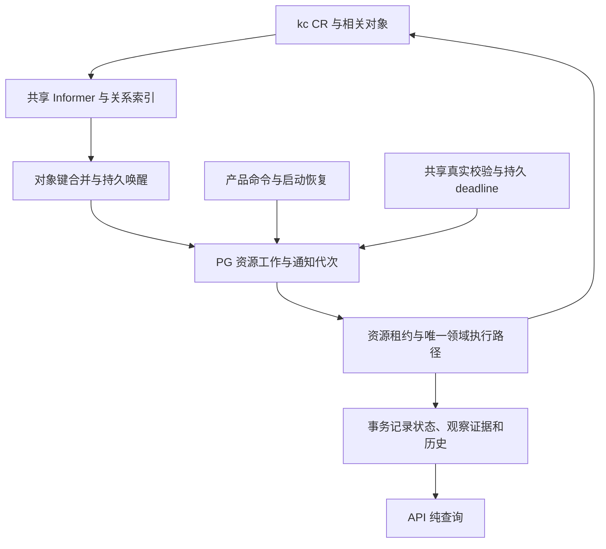

# CR 持续观察与持久执行规格

日期：2026-09-10。版本：1。适用工作包：NET-05A。

本文件是 NET-05A 的目标行为，当前是否实现只看[执行状态](../execution/status.md)。[ADR-0004](../adr/0004-observe-cr-with-durable-reconciliation.md)记录选型与范围；[实施方案](../plans/cr-observation.md)规定步骤和退出证据。资源、operation、Attachment、删除及租户规则继续引用[VPC/Subnet 规格](vpc-subnet.md)，本文件只定义观察与调度增量。

## 1. 目标与边界

覆盖 VPC、Subnet 持续状态观察，以及 Attachment 和删除保护所需的 Pod、VNic、VNicIP、EIP 关系。稳定集合在观察范围内共享缓存和索引，消除每个 Attachment 反复扫描全体关系对象的路径；事件加速变化感知，持久工作与真实校验承担恢复。

保持现有 REST/RPC、公开状态枚举、永久幂等、operation 终态、Provider 创建/删除身份、Attachment 提交封闭和无 RLS 租户约束。Network 不取得 Pod/VM、OVN 或其他产品领域的写入权。

本包不涉及 VM 接入、IAM 接线、Console、生产切流、存量迁移或兄弟仓库实现；不依赖 Core 重构。配额及治理结算延期，不新增占位表、假 RPC、通用 outbox 或账本计数。观察器只提供事实，未来配额决定仍须通过资源 owner 与治理 owner 的独立协议。

## 2. 观察与执行路径



观察 adapter 位于 `internal/data`，隐藏 Kubernetes 类型、GVR、索引和连接管理。`internal/biz` 保留状态转换及所需端口；`internal/server` 和 `cmd/ani-network-service` 管理启动、停止、有界并发、健康及遥测。沿用固定版本 client-go 的 Reflector/ListWatch 恢复能力，不手写断线重列举协议。

Watch handler 只提取对象键、旧/新关系提示并进入有界合并队列，不直接执行 Provider 写入、状态转换或慢 PG/RPC。队列桥接到 PG 调度；溢出或持久化失败须记录范围失效并安排完整清点，进程退出后由启动清点和持久 deadline 补回。内存队列不是唯一恢复依据。

按 cluster、GVR 和明确 namespace/selector 范围复用观察，不能每个产品资源开一个 Watch。VPC/Subnet 通知映射回已有持久 binding；关系通知反向映射 Attachment、Subnet、VPC。索引至少支持稳定 attachment 身份、Pod UID、VNic owner UID、VNicIP 引用和 Subnet 依赖，并保留识别迟到/孤儿对象所需的已知身份。

status-only、deletionTimestamp、归属、标签与引用变化都属于相关变化；generation-only 过滤不适用。处理旧/新关系、同名不同 UID、删除 tombstone 和乱序通知，不能只唤醒新关系一侧。标签只用于候选定位，权威归属仍由 tenant、cluster、绑定及 UID 校验决定。

派生网卡/IP/EIP 可能不带 Network 标签；观察范围必须覆盖完整阻塞关系。selector 外移或缓存缺失均不能证明对象已释放。最小 RBAC 明确 get/list/watch 与现有资源写权限，不增加 Secret 读取或 Pod 写权限。

## 3. 持久唤醒与并发

资源 reconciliation 与 Attachment 调度分别保存独立的 `requested_generation`、`processed_generation`（实现可采用等价命名）。它们是本服务通知代次，不是 Kubernetes resourceVersion、产品 version 或 lease epoch；迁移、默认值和约束必须覆盖已有行与新受理工作。

1. 接受相关通知时，按持久资源身份合并触发并增加待处理代次，不撤销当前有效租约。相同通知的多副本重放不得改变业务结果。
2. Claim 使用数据库时钟和现有资源租约，捕获本次通知代次。产品命令、周期核验、墓碑与 Watch 提示汇入同一执行路径。
3. 外部核验在事务外进行，Finish 继续校验 tenant、版本、lease owner/epoch 与有效期。
4. Finish 只完成已捕获代次；若期间出现新通知，保留下次执行资格，不能无条件用未来时间覆盖新唤醒。禁止借用删除调度的撤销租约行为。
5. 未发送创建、结果未知、owner 封闭查询和重试 deadline 始终有持久恢复入口，不等待下一条 K8s 事件。重复提示不能无限绕过故障退避。

通知代次完成还要求本次事实确实覆盖其对应变化，不能仅因 Claim 读到了最新代次就将其标记完成。多副本缓存可能不同步：A 已应用新事实后，B 即使合法领取最新 PG version，也不能用自己较旧的缓存覆盖状态。观察结果须携带可核验的来源与覆盖证据；不能证明不旧于 Claim 前已持久应用事实、或不能覆盖本次触发时，直接核验/重新同步并保留待处理资格。此约束适用于普通缓存与审计视图，不能靠租约或 resourceVersion 数值比较代替。

完整候选对象集合的摘要不依赖 List/索引返回顺序。计算前只规范化集合顺序，不修改共享视图或省略对象字段；同名异 UID、resourceVersion、地址及状态变化仍改变摘要，对象内部数组仍保留原有顺序。相同事实复用既有摘要不刷新采集时间，也不放宽通知代次、证据过期和 lease/fence 校验。

采用有界 worker 并发，并对 VPC、Subnet、Attachment、不同租户和父资源提供可验证的执行机会；持续 VPC 积压不能使其他类型饥饿。慢 owner RPC/关系核验不得独占全部执行容量。实现记录实际选择的公平策略、并发上限和请求预算，不宣称数据库 SKIP LOCKED 自动提供公平性。

首个部署允许少量副本各持有共享 informer，业务 worker 仍由同一 Network PG 租约协调。按观察范围组织生命周期与索引，为后续按集群/namespace 分片保留边界；本包不预建多集群调度或分布式观察平台。观察副本数、对象规模和内存必须进入容量记录。

## 4. 事实时效与真实校验

保留默认 60 秒观测有效期及 stale 时拒绝 Subnet/Attachment 准入的规则。原有 10 秒逐资源轮询是 NET-05A 前的实现基线；新路径分别管理事件提示、持久重试、owner 查询与真实校验时钟。

稳定集合的真实校验以约 30 秒并带有界抖动作为初始配置候选。最终配置必须在验收负载下满足：

```text
最大校验间隔（含抖动）+ 排队 + 完整采集 + 应用/提交预算 < 60 秒
```

这个数值是待测起点，不能作为已经验证的容量或 SLO。超预算时应真实暴露 stale/积压并拒绝依赖该证据的准入，不能通过读取缓存或修改时间戳维持表面可用。

内部证据区分来源代次、实际采集时间、应用进度与状态变化时间。HasSynced 只说明初次同步；无事件不等于故障；resync 只重放缓存；BOOKMARK 不保证周期。上述信号均不能单独给全部资源续鲜。

真实校验按范围共享完整分页结果，只有采集成功、范围和关系覆盖明确、身份通过核对且已应用到相应资源时才能更新其证据。`observed_at` 对应保守的实际采集时间，不能取慢分页完成或迟到事务提交时间。跨 GVR 没有原子快照，复合结论采用所需证据中最弱的有效时间。

周期 LIST 使用独立审计视图，不直接 Replace 正被 Watch 更新的缓存。审计结论携带采集时来源代次和相关对象通知代次；应用前校验，重连或期间变化使结论失效时重新调度，防止旧快照覆盖已应用的新状态。不能比较不透明 resourceVersion 的数值大小来代替同步边界；不相关对象变化不应导致整个集群的证明永久无法应用。

Egress 观察发现缓存缺项、审计失效或触发代次覆盖不足时，在原调用截止时间内推进数据库采集边界并重新完整采集、直接核对对象。连续 Watch 续接使新审计再次失效时，仍可在同一预算内重新采集，不能仅因一次刷新额度耗尽而提前清空应用事实。取消或超时立即停止且不返回可用证明；实际读取失败按原错误处理，不能作为视图失效反复重试。没有截止时间的内部调用保持最多一次关键路径回退，避免无界循环。所有成功结果继续通过原时效、来源、身份、覆盖和并发围栏检查，不接受替换后的 UID，不仅刷新缓存时间戳维持就绪。

LB 观察在关系核验前或完成后发现审计失效、触发代次覆盖不足时，在原调用截止时间内推进数据库采集边界并重新完整采集；连续 Watch 续接不能仅因一次刷新额度耗尽而提前返回失败。每次重新解析依赖并核验原身份、覆盖、时效及生成对象归属，不接受失效证明，不以保留旧状态代替新采集。取消或超时停止并清空可用证明；真实读取失败按原错误处理，不视为审计失效重试。没有截止时间的内部调用最多一次完整刷新回退，仍失败则交回持久调度。LB、Egress 与 Attachment 的修正和验证范围分别留证，不能由其中一个路径通过推定其他路径或历史所有退化已解决。

Attachment 关系审计在覆盖不足或采集期间来源/相关对象变化时，以当前数据库时间推进完整采集的起始边界，并在原 worker 请求上下文的截止时间内重新采集；连续 Watch 续接不应仅因固定两次尝试耗尽而提前返回失败。此循环不延长请求预算，取消或超时即停止等待且不返回可用证明；采集失败仍按现有错误处理。每次结论继续检查来源、关系覆盖、原 Pod/VNic/VNicIP 身份及应用前围栏。owner 封闭后的采集边界保持，不得使用封闭前的集合完成释放。

节点网卡事实的正常续报须与事实变化区分：同一来源身份、完整网卡内容不变，仅有效采集时间向前推进时，Watch 仍更新缓存，但不使仍新鲜的完整审计失效。旧审计保留原采集时间，不能借续报延长证明寿命；新时间须由后续完整采集读取。节点/ConfigMap 身份、归属、网卡内容或未知字段变化，以及时间回退、未来时间、过期或无效文档，继续触发原有失效与重调度；来源重连的代次边界保持。

缓存用于普通观察和关系定位。创建、未知请求、UID 冲突、删除及 released 判定继续要求必要的直接 API/完整关系核验。优化这类核验可以共享覆盖完整的集合证据，但不能把每个 Attachment 的全集群扫描仅改名后保留。

实例 owner 的持久提交封闭来自其协议；K8s Watch 无法替代该查询。释放仍要求封闭及实际工作负载/网卡/IP 清理证据。缓存 NotFound、Delete 通知、TTL 或连接健康都不能单独完成 deleted/released；已记录 UID 的意外消失不触发自动重建。

## 5. 查询、版本与数据库成本

公开 `version` 继续表示现有业务记录的并发版本，保留本包实施前实际持久回写的递增行为及 Attachment `expected_version`、幂等重放顺序，不改成 CR generation、通知代次或只按 state 字符串递增。新增通知/证据控制字段只用于内部恢复与并发。

本包通过相关变化过滤、键合并、共享校验和调度降频减少重复工作。状态/原因没有变化时不追加领域历史或制造虚拟 operation；但真实证据与调度仍有 PG 写入成本，不以“零稳态写入”为验收承诺。进一步拆分公开业务版本与观察证据写入，需单独定义兼容语义后实施，不能藏在本次性能优化中。

Get/List/GetOperation 保持纯读。验证查询无副作用时，先停止相关后台观察、校验和执行，隔离查询产生的调用；另测只暂停状态应用 worker、保留 Watch 健康的场景，确认未应用的观察不能替持久状态续鲜或继续准入。

新增租户内持久关系继续显式 tenant 谓词及保持租户归属的复合 FK；观察器系统入口只能将 Provider 提示映射到本服务已登记资源。平台级连接状态不伪造租户。不得修改已经执行的 migration 文件以改变校验和。

## 6. 故障处理与遥测

Watch 连接配置独立于短请求超时；GET/写请求仍有界。启动、403、429、410、断线和重连由标准机制恢复，并暴露来源同步、错误、队列最老年龄及重新清点进度。新观察范围在同步前不能当作空集合；Watch 失效时真实校验仍须有独立恢复入口。

观察源健康、PG 可持久受理、worker 活跃和 API 查询可用分别表达；Provider 失联不必让纯查询全部失效。GET/写/Watch、对象字节数、缓存/索引内存、请求合并、worker 公平性、PG 事务/UPDATE/WAL 与证据年龄都须可测量。资源 ID、租户 ID 不能成为无界 metrics label。

## 7. 推广规则

兄弟服务可以采用 client-go 或 controller-runtime，并根据持久意图实际位于 PG 还是 CR 设计恢复。controller-runtime 接 PG 时，Reconcile 可唤醒持久任务，或成为接入持久扫描/并发控制的唯一执行适配；不能与另一套 worker 独立执行相同领域行为。

多个服务可观察同一 CR，但各自仅修改自己负责的产品状态、字段与动作。同服务多副本的共享租约或选主与跨服务所有权是不同问题；不同服务各自的 PG lease 不互斥，职责不同的 Manager 不共用选主锁。选主不撤回旧请求，仍须幂等与条件写入。

兄弟服务需要本域 Provider 事实时可以直接观察，需要另一领域产品结论时消费其版本化 API/事件。接纳本模式不自动授权跨仓改造。各服务文档明确观察范围、控制权、持久权威、幂等和恢复，不强制镜像 PG 或安装公共 runtime。

## 8. 验收合同

以下扩展[VPC/Subnet 验收](vpc-subnet.md#9-可观测性与验收)，实现步骤和证据位置由计划规定；当前结果仅记入执行状态。

| ID | 必须证明的结果 |
|---|---|
| V-16 | 初始同步/403/429/410/断线/静默失联/重连、status-only、重复事件、tombstone、同名不同 UID、旧 LIST 与新 Watch 交错均不会虚构 fresh 或完成释放；暂停应用但保留 Watch 时准入仍受证据有效期约束 |
| V-17 | 真实 PG 覆盖 Claim/Observe/Finish 前中后通知、不丢唤醒、不撤销有效 lease、旧回写拒绝、未创建 CR 的意图重启恢复、PG 中断/内存队列丢失；双副本“新缓存先提交、旧缓存后 Claim”不回退事实或误完成通知；多副本及持续积压下各资源类型/租户仍有执行机会 |
| V-18 | Pod/VNic/VNicIP/EIP 共享索引覆盖旧/新关系、标签丢失和孤儿对象；不再每 Attachment 全集群 LIST；同数据集比较冷启动、稳定态、变化风暴和恢复的 K8s/PG/内存成本，保留版本与幂等兼容证据 |
| V-19 | 在本包精确新源码/镜像上验证真实 kc List/Watch、RBAC、重连与状态传播，并复验 NET-05 普通容器入口、连通/隔离、Attachment 释放和删除保护；旧 NET-05 结果仅作为对照基线 |

正常负载状态传播 p95 ≤2 秒、p99 ≤5 秒作为候选验收目标。实施开始时固定小规模、目标规模及倍增数据集，声明对象数/大小、变化率、副本数、机器与 PG/API 预算，不在看到结果后降低负载来宣称通过。记录达到与未达到的边界，不承诺无限容量。功能正确性、性能目标和真实数据面分开记 `pass / fail / not_verified`；真实 Watch 不代表真实连通已经验证。
