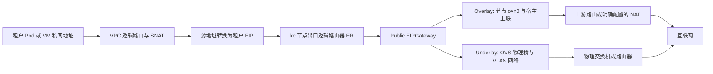

# 租户 VPC SNAT 方案：Overlay 与 Underlay

日期：2026-09-10；版本：1。本文定义 Network 的公网地址申请和 VPC SNAT 增量方案。用户已确认的模式、namespace 和权限要求在本文固化；接口名称、一期数量限制、持久模型和状态表达属于本次形成的工程设计，不代表已经实现或逐项验收。

本文承接 [VPC/Subnet 规格](vpc-subnet.md)、[持续观察规格](cr-observation.md)及既有 [ADR](../START-HERE.md#架构决定)，不改写这些模块已完成的验收边界。实现顺序见 [实施计划](../plans/vpc-snat.md)，实际命令与 YAML 见 [操作手册](../kc-public-egress-manual.md)，当前状态只维护在 [执行状态](../execution/status.md)。旧附件仅为背景，Provider 字段以固定 kc 源码和实际运行结果为依据。

## 1. 目标与一期范围

租户从平台申请 EIP，将其绑定到自己的 VPC，使该 VPC 下已正确接入的私有 Subnet 工作负载能够访问互联网；租户可以停用、重新启用、解绑和释放 EIP。平台管理员负责出口网络、EIPGateway 和 Public 地址池初始化，租户无需看到 Public Subnet 或物理网络。

一期采用以下明确限制，避免 kc 中重叠全 VPC SNAT 规则的优先关系进入产品契约：

- 一个 VPC 最多有一个尚未删除的 SNAT 绑定；绑定停用、degraded、deleting 或结果未知时也占用该位置。
- 一个 EIP 最多有一个尚未删除的产品绑定。先解绑再换绑；不提供原地换 EIP、换 VPC 或跨模式迁移。
- SNAT 覆盖整个 VPC，Provider `spec.cidrs` 省略；暂不开放子网级/指定 CIDR SNAT、多 EIP 出口或优先级。
- IPv4、单集群；VPC/Subnet 仍使用既有私有网络模型。Overlay/Underlay 是 **Public 出口地址池** 的属性，不把租户私有 Subnet 改为 Underlay。
- 普通容器先验收。Underlay 方案纳入本文，实测后续单独进行；VM、IPv6、HA、容量、DNAT/FIP、LB 绑定和公网入站能力不由本方案推导。
- 本轮按独立 Goal 实现 Network 后端并自动测试；合格 kc 上的 Overlay 经 Network 接口验收。Underlay 物理测试延期，ANI Gateway、kc 修复/升级、配额与 IAM 接线不在本轮修改范围。

历史事实：2026-09-10 kind 实测中，新建与重新启用的 Overlay 原始出网失败；补齐一条测试路由下一跳后的双 worker HTTPS 对照成功。完整证据及限制见 [实测记录](../execution/records/KC-OVERLAY-20260910T114200Z/README.md)。该对照不能作为“现有 kc 已可直接上线”的依据。

## 2. 所有权、资源及命名空间

Network 保存产品身份、平台出口配置、租户归属、占用关系、操作和恢复义务；kc 负责 IPAM、CR 状态及 OVN/OVS 下发。Gateway 负责产品入口和已授权租户上下文，实例 owner 负责 Pod/VM 接入与实际工作负载。Network 不直写 OVN、不用 SSH/iptables 充当产品执行路径，不代替实例 owner 创建探测 Pod。

| 产品概念/动作 | kc 映射 | 归属及 scope |
|---|---|---|
| 查询可用物理网卡 | 节点网卡事实与 kc 接管状态 | 平台，只读管理员接口 |
| 接管物理网卡 | `kcn-system/kcn-config.data.managedDevices` | 平台，节点基础设施变更 |
| VLAN 二层网络 | `VlanNetwork` | Cluster 资源，不填 namespace |
| 平台出口网关 | `EIPGateway` | Cluster 资源，不填 namespace |
| Public Address Pool | `Subnet(type: Public)` | 平台，固定 `kcn-system`；不进入租户私有 Subnet CRUD |
| 租户 VPC | `VPC` | 目标租户 namespace；VPC 没有 `spec.type` 字段 |
| 租户 Subnet | `Subnet(type: VPC)` | 与 VPC 相同的目标租户 namespace |
| 租户 EIP | `EIP` | 目标租户 namespace，跨 namespace 引用平台 Public 池 |
| VPC SNAT Binding | `Snat` | 与 EIP、VPC 相同的目标租户 namespace |

平台 Public 池的 `allowedNamespaces.from` 固定 `All`。这仅允许 kc 跨 namespace 使用该池，不是租户访问平台 API、查询池详情或直接写 Kubernetes CR 的授权。租户不获得 kc CR 写权限。All 也不是“仅允许申请 EIP”的细粒度限制；实例 owner 只接受本租户私有 Subnet 的接入结果，不能允许租户绕过 API 直接把工作负载接入平台 Public 池。

`tenant_id`、namespace、Actor 与 Direct Caller 的规则：

1. 普通租户入口由 Gateway 从当前租户上下文补全 `tenant_id`；未确定活动租户就拒绝，不使用空租户或平台租户。公开普通租户 body 不增加自由覆盖 `tenant_id` 的能力。
2. 管理员代租户初始化时显式指定目标 `tenant_id`，先校验代办权限，再调用相同的租户用例；资源归属仍是目标租户，Actor 保留管理员。采用独立管理员路径，不把“传了 tenant_id”当作管理员授权。
3. Network 内部 RPC 继续要求非空 `tenant_id`，按既有持久租户→namespace 映射传给 Provider。EIP/Snat/VPC/私有 Subnet 的 Kubernetes 写入必须显式带该 namespace；客户端不能自由选择另一个 namespace。
4. 绑定必须同时验证 tenant、cluster、namespace、产品资源身份、Provider 名称及已记录 UID。名称相同或同 namespace 本身不构成授权。跨租户目标统一按不存在处理。
5. `Public Subnet` 固定 `kcn-system` 由 Network 后台填写；不是由 Kubernetes 将错误 namespace 中的对象自动迁移。
6. Provider 名称使用全局唯一产品 ID 派生的 DNS 合法名称，不用用户显示名；同租户允许资源显示名重复。标签只帮助定位，不替代持久映射和 UID 校验。

[ADR-0003](../adr/0003-defer-workload-authentication.md)仍适用：目前未验证的调用归因不能冒称真实鉴权。受控测试可显式注入租户，但实际对租户/管理员开放入口前必须接入相应可信授权链。

## 3. 两种出口模式与实际数据路径

| 维度 | Overlay Public | Underlay Public / 用户定义的 VLAN 模式 |
|---|---|---|
| Public 池 `underlayConfig` | 整个字段省略，不能写空对象 | 必须配置二层网络与物理下一跳 |
| VlanNetwork | 此出口不需要 | 必须，`vlanID: 0–4094` |
| VLAN 0 | 不用于表达 Overlay | 表示物理口不带 tag，仍属于本方案 VLAN/Underlay 模式 |
| VLAN 1–4094 | 不适用 | 表示物理口带对应 tag；交换机必须配合 |
| 出口承载 | OVN/OVS、必要的 Geneve 跨节点传输、节点宿主网络及上游 | OVN 逻辑出口、OVS 接管物理口、指定 VLAN/无 tag 二层网络、交换机/路由器 |
| Public `gatewayIP` | OVN 在 Public CIDR 内的接口地址 | 同左；须与物理网关地址不同 |
| 物理下一跳 | 来自节点及上游路由配置，不能填到 Public `gatewayIP` 冒充 | `underlayConfig.gatewayIP`：该物理段内真实交换机/路由器地址 |
| 回程条件 | 上游到 Public CIDR 的路由，或完整的上游 NAT/状态回程 | 上游到 EIP 所在物理网络的路由及相应二层邻接、ARP/过滤配置 |
| 后续验收 | 修复已知缺陷后重测原始流程 | 后续准备真实网卡/VLAN/网关环境，再独立实测 |

**EIPGateway 没有 `type: overlay/underlay` 字段。** 两种模式都使用 `scope: Public`、`egressType: Host`；当前 CRD 仅支持 Host。`egressType` 描述 Overlay 出口方式，Underlay 使用其子网物理路由配置。本方案不使用尚未实现的 `Gateway` 类型或 `gatewayConfig`。

一个 EIPGateway 可以服务两种 Public 池；产品记录每个池的模式和明确的网关引用，不因名称相似自动选择，也不因模式不同强制复制两套网关。同一物理口/VLAN 组合不创建冲突的 VlanNetwork；当前 kc 一个 VlanNetwork 只允许一个 Subnet 占用。

图表示逻辑处理路径，不保证每次都经过 Geneve，也不保证 ER、工作负载和物理出口在同一节点。不同 VPC 可复用私有 CIDR，但出口池须避开基础设施保留地址，并校验共享出口路径没有地址冲突。

SNAT 将租户工作负载私网源地址转换为 EIP，回包由有状态转换返回发起连接的工作负载；不因此向公网开放主动入站。若 EIP 池使用私网地址，上游仍须明确提供 NAT，互联网看到的是上游公网地址。测试中的实际链路是 `10.241.10.2 → 10.250.200.2 → 172.18.0.4 → 139.198.29.154`；前两次转换有节点抓包，最后公网地址由外部服务返回，上游各跳未逐一抓包。

## 4. 平台管理员初始化

### 4.1 Underlay 的网卡发现与二层网络

新增只读管理员网卡接口，按节点返回接口名、类型、MAC、MTU、链路/carrier、非 link-local 地址、master/OVS 占用、kc 接管状态、可选性/不可选原因及 `observed_at`。在 kind 中查询节点容器网络环境，不拿外层 Ubuntu 的同名网卡替代。

筛选以 [kc 实际规则与手册](../kc-public-egress-manual.md#31-查询候选网卡)为基础：

- 当前 `managedDevices` 是全部节点生效的同名接口配置；没有可用于此流程的 VlanNetwork nodeSelector。候选须覆盖目标部署所有适用节点，缺节点、缺设备或观测过期则拒绝接管。
- kc 拒绝存在非 link-local IP 的候选；Network 额外排除管理/默认路由口、loopback、veth/隧道，以及被现有 bridge/bond/其他用途占用的口。不能自动删 IP 或拆 bond 来使网卡“可选”。
- 已接管设备可展示其现有 VlanNetwork 和子网占用，不能伪装为空闲口。跨节点同名、UP 或 IP 为空也不证明交换机 VLAN 已就绪。
- 管理员明确选择物理接口后，后台再次核对同一组节点/设备事实，并以资源版本条件合并 `managedDevices`，保留其他设备和配置；异步等待各节点接管反馈。
- 接管就绪后创建 VlanNetwork，填 `devName` 与 `vlanID`；等待 `Valid/Ready=True`、`notReadyNodes` 为空，核对 OVS bridge mapping 和交换机端口 tag/native VLAN。

设备接管与 VlanNetwork 是两个可观察步骤。部分节点接管失败时保留部分进度并阻止下游池开放，不能自动恢复整个旧 ConfigMap 覆盖他人并发修改，也不能自动撤销已有共享物理网络。删除 VlanNetwork 不等同于物理接口已归还；物理接口退役单独操作并检查依赖。

### 4.2 先创建 EIPGateway

两种模式均先创建 Cluster EIPGateway，再创建 Public Subnet。固定 `scope: Public`、`egressType: Host`；默认省略 `hostConfig`，让 kc 从系统服务网段分配互联地址。`status.localIP` 是系统互联地址，不是 EIP、Public 池网关或节点上联 IP。

等待网关 `Valid/Initialized/Ready=True`、`status.localIP` 非空、`status.boundResources.router` 已存在。已知新网关缓存缺陷在网关 Ready 后仍可能出现，因此这些条件是创建下游资源的必要条件，不能替代第 9 节的 Provider 修复及原始流程验收。

### 4.3 创建 Public 地址池

以下是平台产品输入到 kc 的映射，完整 YAML 只维护在操作手册，避免出现第二份独立操作版本。

| 管理员输入/后台字段 | 如何取值及映射 |
|---|---|
| `mode` | 平台地址池的 `overlay` 或 `underlay`；后台据此决定是否生成 `underlayConfig`，不写入不存在的 EIPGateway type |
| `gateway_id` | Network 中的平台网关 ID；解析为 `Subnet.spec.gateway=<EIPGateway名>`，不填 IP 或 namespace/name；不使用 kc“列表第一项”默认选择 |
| `cidr` | 现场分配的真实出口 CIDR，映射 `cidrBlock`；不得与其他 Public 池、系统服务/互联段、节点/Service 等基础设施地址冲突 |
| `ovn_gateway_ip` | 本 Public CIDR 内预留给 OVN 的接口地址，映射 `gatewayIP`；不是工作负载私有 Subnet 的网关 |
| `excluded_ips` | 管理员声明的单地址或 `起始..结束` 范围，包含 OVN、交换机、已有设备等保留地址；检查范围落在 CIDR，kc IPAM 承担最终分配和冲突判定 |
| `vlan_network_id` | Underlay 必填、Overlay 禁止；后台解析为 `underlayConfig.vlanNetwork` |
| `upstream_gateway_ip` | Underlay 必填；真实物理网关，映射 `underlayConfig.gatewayIP`；须在该物理段内，与 OVN gateway 不同并加入排除列表 |
| `metadata.namespace` | 后台固定 `kcn-system`，管理员无需传租户 namespace |
| `type / ipVersion / allowedNamespaces` | 后台固定 `Public / IPv4 / {from: All}` |
| `enableDHCP / natOutgoing` | 池只分配 EIP，DHCP=false；不靠 `natOutgoing` 为普通租户 VPC 开公网 |

Underlay 等待 Subnet `Valid/Initialized/Ready=True`，并要求 `underlayState.ready=true`、`notReadyNodes` 为空、`chassisNode` 非空、VlanNetwork 占用指向该 Public 池。Overlay 不应存在 `underlayState`。网卡、OVS、ARP、上游过滤与回程仍须独立核对。

一期不提供池的在线 CIDR、模式、网关、排除范围或 VlanNetwork 变更；这些设置按创建快照保留，变更使用新池并按明确迁移流程处理旧 EIP。不能通过修改原池将既有 EIP 隐式切到另一条出口。

### 4.4 出口验收、开放分配和默认池

池的“kc 已创建”“管理员允许新分配”“现场出口已经验证”分别记录。新池默认不开放租户分配；管理员完成对应模式的真实工作负载出网及回程验证，并记录 kc 镜像、池/网关配置、上游路径和证据后才能开放。当前已知缺陷未修复的部署不能靠手工补 OVN 路由取得正式验收。

验收记录绑定具体镜像、出口配置及验证范围；相关配置或版本改变后重新核验，旧证据不能自动用于新配置。已有连接和地址不因此自动删除，新的分配/绑定准入与已存在资源的退化状态分别处理。

一期每个部署集群显式配置一个租户默认 Public 池，作为新 EIP 分配来源；两种模式的池都可先初始化，但租户不选择或列举底层池。默认池切换只影响后续新申请，已有 EIP 保留原池/地址/模式。关闭池的新分配不撤销已有租户地址和流量；退役必须走依赖检查。

“允许新分配”只控制新 EIP 申请。已有 EIP 的绑定/启用检查出口资源健康、证据时效和模式验收，不因分配开关关闭而自行解绑或拒绝使用保留地址；真正退役仍需明确释放全部依赖。

没有默认池、默认池未开放、模式尚未验收、基础资源不就绪或观测过期时，新申请返回明确的出口未就绪错误。容量提示只是观测值，不能按“池大小减 EIP 条数”计算权威剩余量；耗尽以 kc IPAM 的实际结果判断。分配结果未知时不得切池或换名字重试，防止产生多份地址。

## 5. 租户申请与绑定流程

1. **准备 VPC/Subnet。** 沿用现有 API；VPC 与私有 Subnet 同 tenant/namespace，Subnet `type: VPC`、`gateway` 为父 VPC。工作负载通过既有 Attachment 协议正确接入，Network 不新建 Pod/VM。
2. **申请 EIP。** 租户提交名称/描述与幂等键；Network 解析目标租户、选择已开放默认池，将池 ID、配置版本、目标 cluster/namespace 和稳定 Provider 名持久化，再创建租户 EIP。`spec.subnet=kcn-system/<池名>`，`ipVersion=IPv4`，省略 `ipAddress`。一期不开放指定 IP 申请。
3. **确认已分配。** 同 UID 的 EIP `Valid/Initialized=True`、`phase=Available`、实际 `spec.ipAddress` 合法、所属池/网关匹配，且无绑定。Network 保存实际地址；申请 EIP 不等于已经给 VPC 开启出口。
4. **绑定 EIP 到 VPC。** 先校验同 tenant/cluster/namespace、VPC 可用且观测新鲜、EIP 已分配未占用、出口配置允许使用、VPC 无已有绑定。在本地事务预留 VPC 和 EIP 的唯一绑定位置，建立绑定资源/operation，再创建同 namespace 的 Snat。字段为 `spec.eip=<EIP CR名>`、`spec.vpc=<VPC CR名>`、`disable=false`，不传 `cidrs`。
5. **观测应用结果。** 同时核对 Snat 与 EIP，不能只看一次 Bound。资源处于“配置已应用”后，实际工作负载流量另行验证；具体完成条件见第 7 节。
6. **停用与重新启用。** 修改该 Snat 的 `disable`，保持同一绑定、EIP 地址及占用；对每一代期望记录并观测完成。停用不是解绑。旧连接是否保留不作承诺，验收使用新连接。
7. **解绑。** 删除本绑定的 Snat，确认其已真实消失、同 EIP 的 `boundResource` 清空且 phase 回到 Available，才释放本地绑定占用。解绑保留 EIP；可以随后重新绑定其他 VPC。
8. **释放 EIP。** 仅在不存在绑定、没有未知/未完成变更、Provider 也无 Nat/Snat/Service 占用时删除 EIP，确认同 UID 对象不存在后完成释放。已绑定 EIP 的 DELETE 返回占用冲突，不自动断网。

创建、停用、启用与解绑不能互相并行越过未完成结果。解绑时现有 VPC/Subnet/Attachment 保留；删除 VPC 时除既有 Subnet 条件外，还要求没有未删除 SNAT 绑定。不使用 VPC ownerReference 级联删除独立 EIP。

## 6. 产品 API 增量设计

以下定义新增接口的目标行为；当前接线和验证结果只看执行状态。沿用 `/api/v1`、`network.v1`、现有名称/描述校验、错误封装、cursor 及 UTC 时间格式；本仓按固定流程生成 Proto/gRPC 客户端；ANI OpenAPI 接线属于独立范围。Provider 字段仅存在管理员视图或内部 adapter 中。

### 6.1 平台管理员能力

| 能力/RPC 草案 | 关键输入与输出 |
|---|---|
| `ListNodeInterfaces` | 按节点和接管状态过滤，返回第 4.1 节的事实、不可选原因及时间；不等同于 Node.status.addresses |
| `AdoptNetworkDevice` | 明确接口名、节点范围证据、幂等键；异步报告各节点接管结果 |
| `CreateVlanNetwork / Get / List / Delete` | devName、vlanID；接管前置及唯一占用检查 |
| `CreateEgressGateway / Get / List / Delete` | 平台网关名称；本期固定 Public/Host，内部字段隐藏于租户 |
| `CreatePublicAddressPool / Get / List / Delete` | 第 4.3 节输入；异步资源状态；池拓扑、容量原因仅管理员可见 |
| `SetPublicPoolAllocationEnabled / SetDefaultPublicPool` | 指定平台池 ID、并发版本和幂等键；开放须有对应模式验收依据，切换不迁移已分配 EIP |

这些能力使用独立管理员 service/授权面及 `GetPlatformOperation` 查询，不向现有租户 `CreateSubnet` 添加 `type=Public` 绕过所有权。平台记录、操作、幂等使用平台作用域；不往租户表塞空/虚构 tenant_id 以绕过非空约束。最小写权限与网卡接管能力留在基础设施 adapter，不把节点 root 能力暴露给普通租户服务入口。

### 6.2 租户及管理员代办接口

| 拟新增 REST | 内部 RPC | 语义 |
|---|---|---|
| `POST /api/v1/networks/eips` | `CreateEIP` | 名称、描述、idempotency_key；异步分配，返回 EIP 受理快照与 last_operation_id |
| `GET /api/v1/networks/eips` / `GET /api/v1/networks/eips/{id}` | `ListEIPs / GetEIP` | 仅当前租户，列表/详情不返回平台池和节点拓扑 |
| `DELETE /api/v1/networks/eips/{id}` | `DeleteEIP` | 仅未绑定 EIP；进行中重复调用返回同一删除操作 |
| `POST /api/v1/networks/vpcs/{vpc_id}/snat` | `BindVPCSnat` | body `eip_id,idempotency_key`；创建全 VPC 绑定并启用 |
| `GET /api/v1/networks/vpcs/{vpc_id}/snat` | `GetVPCSnat` | 查询当前非 deleted 绑定；无绑定返回 404 |
| `GET /api/v1/networks/vpc-snat-bindings/{binding_id}` | `GetVPCSnatBinding` | 按稳定 ID 查询，保留 deleted 墓碑，供 Location 与历史查询使用 |
| `PATCH /api/v1/networks/vpcs/{vpc_id}/snat` | `SetVPCSnatEnabled` | body `binding_id,enabled,expected_version,idempotency_key`；只能变更启停 |
| `DELETE /api/v1/networks/vpc-snat-bindings/{binding_id}` | `DeleteVPCSnatBinding` | 按不可重用的绑定 ID 解绑，防止迟到请求删掉同 VPC 的新绑定 |

管理员代办采用 `/api/v1/admin/tenants/{tenant_id}/networks/...` 对应上述资源路径，并包括现有 VPC/Subnet 初始化动作；经管理员授权后重用相同 RPC/use case，不建第二份租户状态机。普通租户公开 body 继续不接受任意 tenant_id。平台基础设施 API 本身不要求租户身份。

创建 EIP/绑定返回 `201` 受理快照；新启停或解绑/释放返回 `202` 受理结果，operation 表明异步进度，未发生新操作的同意图重放返回原受理快照。EIP/绑定均有稳定 opaque ID，建议分别以 `eip_` / `snat_` 加 UUID 派生；列表分页和墓碑按既有规格。新增 operation/resource kind 为 EIP、VPC SNAT 绑定及其实际变更，生成契约需显式扩展，不能把它们伪装成 CreateVPC。

响应增量：

- EIP：既有资源公共字段，加 `address`（未分配为空）、`binding_id`、`binding_state`（unbound/reserved/bound）；地址释放后仅作历史观测，不承诺仍属于该租户。租户不看到 pool ID、CIDR、gateway/node/namespace/CR 名。
- VPC SNAT 绑定：公共字段加 `vpc_id,eip_id,eip_address,desired_enabled,applied_enabled`；`applied_enabled` 未知时为空，不能回显期望值冒充已应用。`state=available` 表示本次配置已应用；停用后的展示为“已停用”，不会显示“已出网”。
- 如展示流量验证结果，另用 `connectivity_verification`，包含 `unknown/pass/fail`、验证时间、配置版本及明确验证范围；默认 unknown。平台池的抽样成功不能标记每个租户工作负载为已验证；过期或配置/绑定代次变化即失效。该字段不新增一个自动创建 Pod 的职责。

拟新增业务原因包括 `PUBLIC_EGRESS_NOT_READY`、`EIP_POOL_EXHAUSTED`、`EIP_IN_USE`、`VPC_SNAT_EXISTS`、`RESOURCE_BUSY`、`PROVIDER_IDENTITY_CONFLICT`、`PROVIDER_STATE_MISMATCH`。受理前错误按现有封装映射 400/404/409/503；受理后的 IPAM 耗尽或 Provider 错误写入 operation/resource 原因，不改写已经返回的受理响应。租户错误只给稳定脱敏说明，平台池名和原始 controller 日志仅管理员可见。

### 6.3 幂等与并发输入

CreateEIP、BindVPCSnat、启停分别使用 `(tenant_id, operation_kind, idempotency_key)` 的永久幂等域。先做当前身份/租户及无状态规范化，再查已受理记录，最后才检查动态池/资源状态。已受理的 EIP 申请不会因默认池切换而改分另一个池；默认池不参与重放时重新计算的请求指纹，而是首次受理时固定的分配目标。

启停指纹包含绑定 ID、目标 enabled 与 expected_version，重放先于当前版本比较。新命令按 expected_version 做 CAS；旧绑定 ID 即使 VPC 已重新绑定也不能指向新对象。已达到同一期望且实际已观测时可幂等返回原应用结果，不制造 Provider 写入；结果未知时继续原操作。

Delete 使用不可重用的 EIP/绑定 ID，天然按目标幂等；进行中重放继续原 operation。资源 deleting、同名 CR UID 变化或创建结果未知时，不释放占用、不换名字重新创建。

## 7. 观察、状态及完成条件

沿用已有 ResourceState 和 OperationState，扩展适用的资源/动作种类；EIP 分配、绑定占用和启停是独立维度，不能塞进单个 Bound 字段。Get/List 为纯查询，资源状态会随 Provider 后续漂移退化，历史 operation 结果不改写。

| 动作/对象 | 必须观察的 Provider 事实 | Network 应表达 |
|---|---|---|
| EIP 分配完成 | 同 UID；Valid/Initialized=True；spec.ipAddress 非空、合法且属于固定池；spec.subnet、status.gateway 匹配；phase=Available、boundResource 为空 | EIP available、binding_state=unbound；不是 VPC 出网成功 |
| 启用绑定完成 | Snat Valid=True、phase=Bound、spec eip/vpc/disable 匹配；EIP Valid/Initialized=True、phase=Bound；boundResource.resourceType=Snat、resource/vpc 引用匹配、对象 namespace 相同、disabled=false、nodeName 非空；boundResource.observedGeneration 等于本次目标 Snat generation | 绑定配置 applied，applied_enabled=true；连通验证单独表达 |
| 停用完成 | 同一 Snat 的 spec.disable=true、Valid=True、phase=Disabled；EIP 仍指向该绑定、disabled=true、observedGeneration 匹配；nodeName 可以为空，不能因此误判为解绑 | applied_enabled=false；EIP 仍占用，绑定 retained |
| 解绑完成 | 按已记录 UID 核对 Snat 真正不存在；同 EIP 的 boundResource 清空且 Available；没有其他 Provider 绑定冲突 | 绑定 deleted、EIP unbound；解除本地预留 |
| EIP 释放完成 | 同 UID 的 EIP 真正不存在，相关未知写入/墓碑处理已满足既有删除合同 | EIP deleted，保留历史映射与幂等 |
| Provider 配置与本地身份冲突、已应用对象丢失 | 直接核验后保存身份/引用异常；不得自动接受他人同名对象 | degraded 或 blocked；不自动收养、重建或释放资源 |
| 观察过期/权限错误/关系集合不完整 | 依据持续观察规格保留 stale 和未完成义务 | 不承诺 available 准入，不用缓存 NotFound 完成删除 |

`boundResource.vpc` 的实际格式为 `namespace/name`，`resource` 是当前 namespace 内的 Snat 名；namespace 从对象 metadata 校验。目标 generation 由 adapter 记录成功写入/直接核验获得，不能混用 Network version。kc 并非每个 CR 都给通用 observedGeneration，不能对不存在的状态字段做 Ready 判定。

Snat/EIP Bound 不证明 OVN 下一跳有效、物理网关可达、DNS 可用或公网可达。本次缺陷正是反例。Provider 修复与模式验收属于部署前提；Network 正常执行仍通过 CR 观察，不为规避缺陷增加直写 OVN、controller 重启或节点 NAT 修补逻辑。

新增 EIPGateway、Public Subnet、VlanNetwork、EIP、Snat 及必要的 Nat/Service 绑定冲突观察，遵循 [共享观察与持久执行](cr-observation.md)。索引按 cluster + namespace + name/UID、EIP→绑定、VPC→绑定、池→EIP、网关/二层网络→池构建；平台依赖变化按持久关系唤醒租户资源，不全租户逐对象查询。status-only、旧/新引用、同名异 UID、断线和迟到事实均须处理。既有系统 namespace 下观察范围不等于租户查询权限。

实现定位：[出网用例与授权端口](../../internal/biz/egress.go)、[平台受理事务](../../internal/data/platform.go)、[租户受理事务](../../internal/data/egress.go)、[kc 出网 adapter](../../internal/data/kc_egress.go)以及[共用 worker](../../internal/biz/worker.go)。平台资源通过同一 worker 的持久租约分支处理，未增设平行生命周期 worker。网卡事实采集器只提供节点原始事实，不受理产品意图，部署契约见[说明](../../deployments/egress/README.md)。

平台地址池返回的 `topology_fingerprint` 覆盖固定配置、配置版本、池/网关/VLAN/设备配置对象 UID 和实际观察到的 provider 镜像集合。验收记录同时匹配该 fingerprint 与运行镜像 digest；失效或镜像变化阻止新的准入，已有地址及占用不自动清理。VLAN/池的唯一占用槽仅在外部删除被确认后退休；旧资源记录及幂等快照保留。

## 8. 持久模型、删除保护与恢复

新增产品表见[增量 migration](../../migrations/0005_vpc_egress.sql)，逻辑关系在本文固定：平台二层网络、出口网关、Public 池及平台操作独立保存；租户 EIP、VPC SNAT 绑定及其 operation/history/idempotency 进入 Network 自有数据库。平台资源没有虚构 tenant，租户关系全部带显式 tenant 条件。

| 关系/约束 | 要求 |
|---|---|
| EIP → Public 池 | EIP 记录 tenant_id、cluster_id、pool_id 及首次选择版本；通过本领域关系约束同 cluster 的平台池，这是有意的租户→平台引用 |
| 绑定 → VPC / EIP | 使用 `(tenant_id,vpc_id)`、`(tenant_id,eip_id)` 复合 FK，并验证 cluster/namespace 映射一致；不能只按裸 ID 建 FK |
| 一 VPC / 一 EIP 一绑定 | 对所有尚未 deleted 的绑定分别建立租户内唯一约束；failed、disabled、deleting、结果未知均不提前释放 |
| Provider 身份 | 保存 cluster/GVR/namespace/name/UID 和本次期望版本；平台及租户 Provider 名全局唯一，服务写入带归属标识和条件保护 |
| IPAM | kc 为地址分配唯一权威；Network 保存分配结果与身份，不另建可竞争的 IP 分配器 |
| 未完成操作 | 资源、占用、operation、幂等及受理快照在同一 Network 事务提交；worker 可在请求进程退出后恢复 |

新绑定与 VPC 删除共用同租户父 VPC 锁，EIP 绑定与 EIP 释放共用 EIP 锁。新增固定顺序为 **VPC → EIP → SNAT绑定/Operation**；不逆向加锁，不在本事务锁住 Subnet/Attachment。绑定父身份不可变，可先按租户读取 ID，再按此顺序加锁并重新核验；EIP 单独释放只需 EIP 锁并检查占用。既有 VPC→Subnet→Attachment 路径保持原顺序。

Provider 调用在事务外，通过现有租约、版本 fencing、稳定名称和 UID 条件写入保证恢复。一次受理的 EIP 分配未知时保留原池和映射，不换池重复申请；地址已经分配但回写失败时观察同一对象继续记账。绑定外部请求未知时不能把 EIP 标为 unbound；禁用/启用之间发生故障也必须按本次目标 generation 收敛。

解除本地唯一占用前必须满足第 7 节真实解绑条件。检测到非 Network 创建的 Nat/Snat/Service 使用本 EIP 时停止释放并报告冲突，不删除外部对象。VPC 删除要求无尚未 deleted 的绑定；EIP 删除不级联解绑；平台池删除要求停止新分配并确认所有 EIP 与其他实际消费者已释放；网关和 VlanNetwork 删除要求相关池已清理。临时手测资源不自动收养为产品资源。

关闭默认池新分配、切换默认池与分配受理之间须在平台池/配置版本事务上串行核验，已有租户持久意图保留原目的池。平台退役要等待已受理但尚未生成 CR 的分配义务，不仅检查 Kubernetes 当前列表。租户 EIP 与平台池的依赖锁/删除准入必须统一采用“先平台池/配置、再租户 EIP”的顺序；绑定操作不锁平台池，只核对已固定池的有效观测，不形成相反锁链。

## 9. kc 缺陷与发布前提

| 缺口 | 依据及处理要求 |
|---|---|
| 新 EIPGateway 缓存遗漏 serviceIP | 固定源码 `EIPHandler.LoadGatewaySubnet` 只填 scope/subnets，`addEIPRoutesOnER` 将空 serviceIP 写为下一跳；已有现场双 worker 失败与单字段对照证据。kc 修复热加载及缓存有效性，空/未就绪网关不得成功下发路由；测试新网关、重启加载和 disable→enable。 |
| EIP 初次绑定跨 namespace 裸名匹配 | `selectBoundObj` 对 Nat/Snat/Service 的 List 使用裸 EIP 名索引且未限定 namespace。Network 同 namespace 和全局唯一 Provider 名是必要防线，不能宣称修复了 kc 的查询隔离；kc 需收紧候选范围并做同名跨租户负例。 |
| Snat 接受跨 namespace VPC 引用 | 解析 spec.vpc 的 namespace/name 后未强制与 Snat 相同。Network adapter 强制同租户同 namespace；kc 校验应补齐，对直接非法 CR 给出明确拒绝。 |

修复归属 kc-networking，不向本仓库添加 kc 实现任务。原始出口验收必须使用可追踪源码/镜像且不依赖手工下一跳修补；不能以“重启控制器后缓存碰巧完整”关闭新网关问题。Underlay 同样经过 ER→网关的公共路径，需携带同一修复验证；当前没有 Underlay 运行结论，也不能断言它不受该缺陷影响。

本次测试的条件性成功仅证明私有 EIP + 临时节点 NAT 的 Overlay 路径。Overlay 正式部署还须验证真实可路由地址/上游 NAT、回程及 DNS；Underlay 后续须核定物理端口和交换机，完成 VLAN 0 与带 tag 场景，不能在当前只有管理网卡的 kind 环境直接接管 eth0 来模拟物理公网。

## 10. 验收合同

每项分别记录 pass/fail/not_verified，包含 Network/kc 源码和实际镜像、集群、输入、命令、时间、预期/实际源地址及清理差异；不以 CR Bound 或 HTTP 请求已受理替代工作负载出网。

| ID | 必须证明的行为 |
|---|---|
| SNAT-V01 | 管理员网卡列表、不可选原因、部分节点失败、并发 managedDevices 保护；不覆盖管理口或他人配置；平台池/网关/VLAN 归属正确 |
| SNAT-V02 | 租户不能查询/修改 Public 池；All 只允许 Provider 跨 namespace 使用；管理员代办资源归属正确，普通租户伪造 tenant/ns 不越权；真实鉴权与受控注入结果分开 |
| SNAT-V03 | EIP 自动分配与实际 spec.ipAddress、池耗尽、默认池关闭/切换、未知结果恢复、同键重放与无重复分配；跨 tenant/cluster FK 负例 |
| SNAT-V04 | 并发两个 VPC 抢同 EIP、同 VPC 抢两个 EIP、绑定与删除竞态；disabled/failed/unknown 仍保留唯一占用；跨 namespace 同名 Nat/Snat/Service 不误绑 |
| SNAT-V05 | 完整 lifecycle：未绑定→绑定→停用→重启用→解绑→释放；每代 CR/UID/引用/generation 和产品状态吻合；迟到 Delete 不删除新绑定 |
| SNAT-V06 | Overlay 原始配置在控制器运行后新建网关，两 worker/同 VPC 两子网出网；证明私网源→EIP；如果有上游 NAT，明确最终源地址；不手改 OVN |
| SNAT-V07 | Overlay 正/负对照同时验证 VPC 内连通，避免以 Pod 未启动、镜像缺失、端点故障冒充隔离；外部节点控制与业务 Pod 探测分开 |
| SNAT-V08 | DNS UDP/TCP、域名 HTTPS/TLS、跨节点 MTU/较大响应及回程；Cluster DNS 在 intranetNetworks 时独立处理内部可达性，Public SNAT 不自动开放内网目的 |
| SNAT-V09 | Underlay 后续实测：VLAN 0 与至少一组 1–4094、真实物理口/OVS mapping、OVN/交换机两种网关、ARP、出口 chassis、外部源地址/回程和相同 lifecycle；错误 tag/下一跳的负例不能影响管理面 |
| SNAT-V10 | API/DB/Provider 故障、未知请求、Watch/status-only/旧缓存、同名异 UID及多 worker 恢复；Get/List 纯读；平台依赖退化正确传播，不提前释放 EIP |
| SNAT-V11 | 解绑不删 EIP、EIP释放真实完成、VPC/池/网关/VLAN删除占用保护；清除测试 CR/路由/NAT并保留原有资源 UID/工作负载；共享 ER 等 Provider 残留差异明确记录 |

## 11. 依据与文档职责

- [领域词汇](../../CONTEXT.md)：EIP、Public 地址池及 SNAT 绑定的定义；本文负责增量规则。
- [手动操作手册](../kc-public-egress-manual.md)：管理员与租户完整 YAML/命令，以及固定 kc commit 的逐项源码链接；本文不重复维护另一套可执行模板。
- [2026-09-10 Overlay 实测](../execution/records/KC-OVERLAY-20260910T114200Z/README.md)：只读使用已完成证据，包含原始失败、对照、DNS 未完成和共享 ER 保留差异；本轮没有重跑。
- [源码输入](../execution/records/KC-OVERLAY-20260910T114200Z/source-snapshot.json)：Network `e481e968d3cc2f17bc4c6a736c438428519b09a0`，kc `a2245883eb2b46a998f041feb3ad0ed3f6cf7c60`；运行镜像与 kc 编译提交的精确关联尚未验证。
- 当前 [Network RPC](../../api/network/v1/network.proto)只有既有 VPC/Subnet/Attachment/Operation 能力；本文所列 EIP/Snat/平台接口仍是目标设计。
